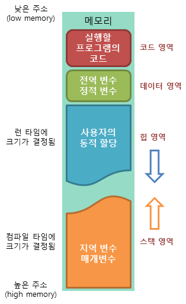
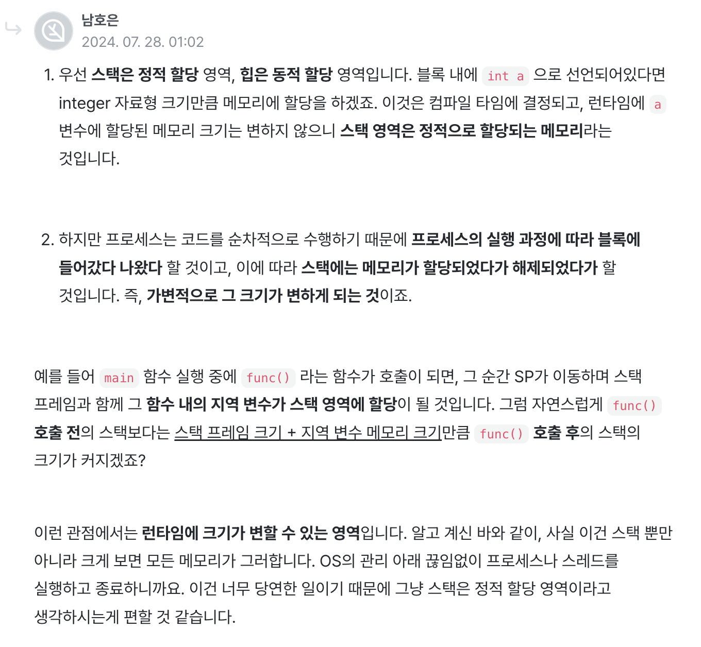

# 📦 [프로세스 메모리 구조](http://www.tcpschool.com/c/c_memory_structure)

---

## 📌 코드(Code) 영역

- 실행할 프로그램의 코드 저장
- CPU가 명령어를 읽어 처리
- 읽기 전용

## 📌 데이터(Data) 영역

- 전역 변수, static 변수 저장
- 프로그램 시작 시 할당되고 종료 시 해제

## 📌 힙(Heap) 영역

- 사용자가 직접 할당하는 **동적 할당 영역**
- C/C++ 에서는 프로그래머가 직접 할당/해제
- Java에서는 가비지 컬렉터(Garbage Collector)가 관리
- **낮은 주소 → 높은 주소** 방향으로 할당
- 크기가 유연, 실행 중 동적으로 사용 가능
- 접근 속도 느림, 메모리 누수 위험

## 📌 스택(Stack) 영역

- **함수 호출과 관련된 임시 데이터** 저장 (지역 변수, 매개변수, 반환값 등)
- 함수 호출 시 자동 할당, 종료 시 자동 해제
- **후입선출(LIFO)** 구조
- 메모리 상에서 **높은 주소 → 낮은 주소** 방향으로 할당
- OS/컴파일러가 크기 할당
- 접근 속도 빠름
- 크기 제한, 초과 시 **Stack Overflow**

## 🔖 메모리 상호작용

- 스택은 위에서 내려오고, 힙은 아래에서 올라감
- 두 영역이 충돌하면 **Stack Overflow** 또는 **Heap Overflow** 발생

## 😮 [스택 영역의 크기는 정적인가요? 동적인가요?](https://www.inflearn.com/community/questions/981575/%EC%8A%A4%ED%83%9D-%EC%98%81%EC%97%AD%EC%9D%98-%ED%81%AC%EA%B8%B0%EB%8A%94-%EC%A0%95%EC%A0%81%EC%9D%B8%EA%B0%80%EC%9A%94-%EB%8F%99%EC%A0%81%EC%9D%B8%EA%B0%80%EC%9A%94?)

## 🔖 힙이 스택보다 느린 이유?

- 스택은 변수의 위치가 고정되고, 주소가 계산식(오프셋)으로 바로 알 수 있어 한 번의 접근으로 값 불러올 수 있음
- 힙은 런타임에 주소가 결정되며, 포인터를 통해 한 번 더 주소 참조 후 값을 불러옴
