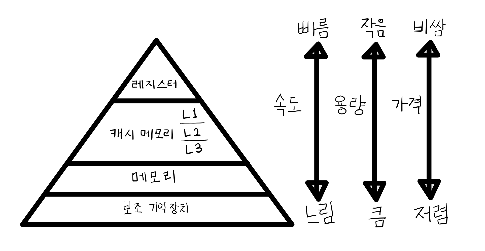

# 📕 Chapter 06 메모리와 캐시 메모리

## ✅ 06-1 RAM의 특징과 종류

### 📌 RAM의 특징

- RAM(메모리)에는 실행할 프로그램의 명령어와 데이터 저장
- 전원을 끄면 저장된 명령어와 데이터가 사라짐
- `휘발성 저장 장치` : 전원을 끄면 저장된 내용이 사라짐
  - `비휘발성 저장 장치` : 전원을 끄면 저장된 내용이 사라지 않음
    - 하드디스크, SSD, CD-ROM, USB 등의 보조기억장치
- 보조기억 장치에는 보관할 프로그램을 저장 → RAM으로 복사하여 저장해 실행

### 📌 RAM의 용량과 성능

- RAM 용량이 크면 많은 프로그램들을 동시에 빠르게 실행하는 데 유리함
- RAM 용량이 필요 이상으로 커졌을 때 프로그램 실행 속도가 비례 하는 것은 아님

### 📌 RAM의 종류

- [`DRAM`](#-dram)
- [`SRAM`](#-sram)
- [`SDRAM`](#-sdram)
- [`DDR SDRAM`](#-ddr-sdram)

### 🔍 DRAM

- Dynamic RAM
- 저장된 데이터가 동적으로 변하는(사라지는) RAM
- 시간이 지나면 저장된 데이터가 사라짐
- 데이터의 소멸을 막기 위해 일정 주기로 데이터를 재활성화(다시 저장) 해야함
- **일반적으로 메모리로써 사용하는 RAM**
- 소비 전력이 비교적 낮고, 저렴하고, 집적도가 높아 대용량으로 설계하기 용이
  - `집적도` : 집적 회로의 단위 면적당 또는 한 개의 집적 회로당 포함되는 소자의 수
  - 집적도가 높다 = 더 작고 빽빽하게 만들 수 있다

### 🔍 SRAM

- Static RAM
- 저장된 데이터가 변하지(사라지지) 않는 RAM
- 시간이 지나도 데이터가 사라지지 않아 데이터를 주기적으로 재활성화 할 필요 없음
  - 전원이 꺼지면 휘발되는건 마찬가지
- DRAM보다 일반적으로 속도가 빠름
- 소비 전력이 크고, 가격이 높고, 집적도 낮음
- 대용량으로 만들 필요가 없지만 속도가 빨라야 하는 저장 장치에서 사용
- 캐시 메모리에서 사용됨

|               | DRAM   | SRAM        |
| ------------- | ------ | ----------- |
| **재충전**    | 필요함 | 필요없음    |
| **속도**      | 느림   | 빠름        |
| **가격**      | 저렴함 | 비쌈        |
| **집적도**    | 높음   | 낮음        |
| **소비 전력** | 적음   | 높음        |
| **사용 용도** | RAM    | 캐시 메모리 |

### 🔍 SDRAM

- Synchronous Dynamic RAM
- 클럭 신호와 동기화 된 발전된 형태의 DRAM
- 클럭 타이밍에 맞춰 CPU와 정보를 주고받을 수 있음
- Single Data Rate SDRAM

### 🔍 DDR SDRAM

- Double Data Rate SDRAM
- **가장 흔히 사용되는 RAM**
- 대역폭을 넓혀 빠르게 만든 SDRAM
- `대역폭` : 데이터를 주고 받는 길의 너비
- DDR SDRAM : SDR SDRAM보다 대역폭이 두 배 넓음
- DDR2 SDRAM : SDR SDRAM보다 대역폭이 네 배 넓음
- DDR3 SDRAM : SDR SDRAM보다 대역폭이 여덟 배 넓음
- DDR4 SDRAM : SDR SDRAM보다 대역폭이 열여섯 배 넓음

## ✅ 06-2 메모리의 주소 공간

- 물리 주소 : 메모리 하드웨어가 사용하는 주소
- 논리 주소 : CPU와 실행 중인 프로그램이 사용하는 주소

### 📌 물리 주소와 논리 주소

- 프로그램이 실행되고 종료됨에 따라 메모리에 저장된 정보는 시시각각 변함
- CPU와 실행 중인 프로그램이 메모리에 저장된 정보를 다 알 수는 없음
- `물리 주소` : 말 그대로 정보가 실제로 저장된 하드웨어 상의 주소
- `논리 주소` : 실행 중인 프로그램 각각에 부여된 0번지부터 시작되는 주소
- 메모리와 CPU가 상호작용 하려면 물리 주소와 논리 주소 간에 변환 필요
- `메모리 관리 장치(Memory Management Unit, MMU)`
  - 논리 주소와 물리 주소 간의 변환
  - CPU 주소 버스 사이에 위치
  - CPU가 발생시킨 **논리 주소에 베이스 레지스터 값을 더하여** 논리 주소를 물리 주소로 변환
- `베이스 레지스터` : 프로그램의 가장 작은(첫) 물리 주소
- `논리 주소` : 프로그램의 시작점으로부터 떨어진 거리

### 📌 메모리 보호 기법

- 논리 주소 범위를 벗어나는 명령어 실행을 방지하고 실행 중인 프로그램이 다른 프로그램에 영향을 받지 않도록 보호해야 함
- `한계 레지스터` : 논리 주소의 최대 크기 저장
- 베이스 레지스터 값 <= 프로그램의 물리 주소 < 베이스 레지스터 값 + 한계 레지스터 값
- CPU가 메모리에 접근 전 접근하고자 하는 논리 주소가 한계 레지스터보다 작은지 검사
- CPU가 한계 레지스터보다 높은 논리 주소에 접근하려고 하면 인터럽트(트랩) 발생시켜 실행 중단

## ✅ 06-2 캐시 메모리

### 📌 저장 장치 계층 구조

    1. CPU와 가까운 저장 장치는 빠르고, 멀리 있는 저장 장치는 느리다.
    2. 속도가 빠른 저장 장치는 저장 용량이 작고, 가격이 비싸다.

- `저장 장치 계층 구조` : 컴퓨터가 사용하는 저장 장치들을 CPU에 얼마나 가까운가를 기준으로 계층적으로 나타냄

### 📌 캐시 메모리

- CPU가 메모리에 접근하는 속도 (느림) < 레지스터에 접근하는 속도 (빠름)
- 그럼에도 불구하고 메모리에 접근해야 함
- 연산 속도가 아무리 빨라도 메모리 접근 속도가 느리면 속도 ↓
- `캐시 메모리` : CPU의 연산 속도와 메모리 접근 속도의 차이를 줄이기 위한 저장 장치
  - CPU와 메모리 사이에 위치
  - 레지스터보다 용량이 큼
  - 메모리보다 빠름
  - SRAM 기반 저장장치
- CPU가 사용할 데이터를 미리 캐시 메모리로 가져와서 활용
- CPU(코어)와 가까운 순서대로 L1 캐시, L2 캐시, L3 캐시 계층 형성
  - 일반적으로 L1, L2는 코어 내부, L3는 외부에 위치
  - 용량 : L1 < L2 < L3
  - 속도 : L3 < L2 < L1
  - 가격 : L3 < L2 < L1
- L1, L2는 코어마다 할당, L3는 여러 코어가 공유

  

### 🔖 분리형 캐시(split cache)

- 코어와 가장 가까운 L1 캐시는 조금이라도 접근 속도를 빠르게 하기 위해 분리하기도
- 명령어만을 저장하는 L1I 캐시
- 데이터만을 저장하는 L1D 캐시

### 📌 참조 지역성 원리

- 캐시 메모리 용량 < 메모리 용량
- 캐시 메모리는 메모리의 일부만 저장
- CPU가 사용할 법한 데이터를 예측하여 저장
- `캐시 히트` : 자주 사용될 것으로 예측한 데이터가 실제로 들어맞아 캐시 메모리 내 데이터가 CPU에서 활용되는 경우
- `캐시 미스` : 자주 사용될 것으로 예측했지만 예측이 틀려 메모리에서 필요한 데이터를 직접 가져와야 하는 경우
- `캐시 적중률` : 캐시 히트 횟수 / (캐시 히트 횟수 + 캐시 미스 횟수)
  - 일반적으로 85%~95% 이상
- 캐시 메모리는 `참조 지역성의 원리` 에 따라 메모리로부터 가져올 데이터를 결정
- **`참조 지역성의 원리`** : CPU가 메모리에 접근할 때의 주된 경향을 바탕으로 만들어진 원리

      1. CPU는 최근에 접근했던 메모리 공간에 다시 접근하려는 경향이 있다.
      2. CPU는 접근한 메모리 공간 근처를 접근하려는 경향이 있다.

### 📌 최근 접근했던 메모리 공간에 다시 접근하려는 경향

- 변수에 값을 저장하고 나면 언제든 변수에 다시 접근하여 저장된 값을 사용할 수 있다
- CPU는 변수가 저장된 메모리 공간을 언제든 다시 참조할 수 있다
- 변수에 저장된 값은 일반적으로 한 번만 사용되지 않고 프로그램이 실행되는 동안 여러 번 사용된다
- **시간지역성**

### 📌 접근한 메모리 공간 근처를 접근하려는 경향

- 실행하려는 프로그램은 보통 관련 데이터끼리 모여있음
- 프로그램 내에서도 관련 있는 데이터는 모여서 저장됨
- 워드 프로세서를 실행하면 워드 프로세서 프로그램이 모여 있는 공간을 집중적으로 접근
- 사용자가 입력을 하면 입력 기능이 모여있는 공간을 집중적으로 접근
- **공간 지역성**
