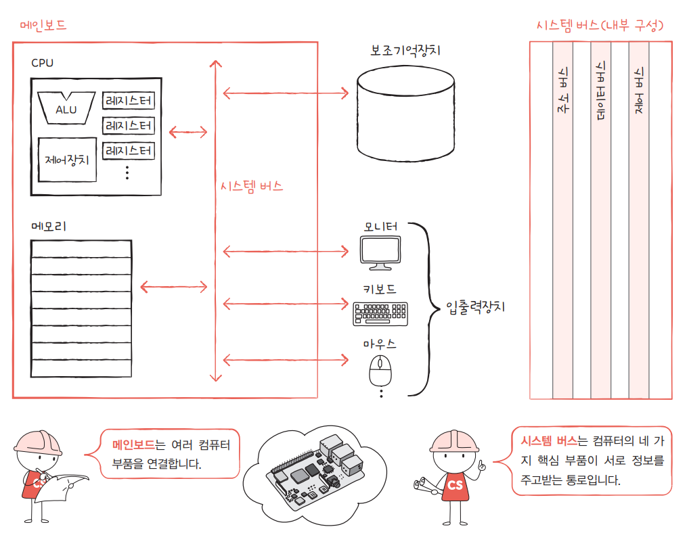

# Chap.1 컴퓨터 구조 시작하기

## 01 컴퓨터 구조를 알아야하는 이유

- **문제 해결**  
   컴퓨터 구조를 이해하고 있으면 문제 상황을 빠르게 진단, 문제 해결의 실마리를 다양하게 찾을 수 있음  
   → 다양한 문제를 스스로 해결할 줄 아는 개발자가 되기 위한 스터디
- **성능, 용량, 비용**  
   프로그램을 위한 최적의 컴퓨터 환경을 스스로 판단하기 위해서는 컴퓨터 구조를 꼭 알아야 함

## 02 컴퓨터 구조의 큰 그림

### 컴퓨터가 이해하는 정보

컴퓨터는 0과 1로 표현된 정보만을 이해

> [0과 1로 표현되는 정보]
>
> - **데이터**  
>   컴퓨터가 이해하는 숫자, 문자, 이미지, 동영상 → `정적인 정보`
>
> - **명령어**  
>   컴퓨터는 명령어를 처리하는 기계  
>   컴퓨터를 실직적으로 작동시키는 중요한 정보  
>   → 데이터를 움직이고 컴퓨터를 작동시키는 정보

💡 명령어는 컴퓨터를 작동시키는 정보, 데이터는 명령어를 위해 존재하는 일종의 재료  
 컴퓨터 프로그램 = 명령어들의 모음

### 컴퓨터의 4가지 핵심 부품

- 중앙처리장치(CPU)
- 주기억장치(메모리)
- 보조기억장치
- 입출력장치  
   

 

**[메모리]**  
현재 실행되는 프로그램의 명령어와 데이터를 저장하는 부품  
→ 프로그램이 실행되려면 반드시 메모리에 저장되어야 함

`주소` : 메모리에 저장된 값에 빠르고 효율적으로 접근하기 위한 값

> - 프로그램이 실행되기 위해서는 반드시 메모리에 저장
> - 메모리는 현재 실행되는 프로그램의 명령어와 데이터를 저장
> - 메모리에 저장된 값은 주소를 통해 접근

 

**[CPU]**  
메모리에 저장된 명령어를 읽어 들이고, 읽어 들인 명령어를 해석, 실행하는 부품

① **산술논리연산장치(ALU)** : 계산기  
② **레지스터** : CPU 내부의 작은 임시 저장 장치  
③ **제어장치** : 제어 신호라는 전기 신호를 내보내고 명령어를 해석하는 장치  
\*제어 신호 : 컴퓨터 부품들을 고나리하고 작동시키기 위한 일종의 전기 신호

> - CPU는 메모리에 저장된 값을 읽어 들이고, 해석하고 실행하는 장치
> - CPU 내부에는 ALU, 레지스터, 제어장치 존재
> - ALU = 계산기, 레지스터 = 임시 저장 장치, 제어장치 = 제어 신호 발생, 명령어 해석 장치

 

**[보조기억장치]**  
메모리보다 크기가 크고 전원이 꺼져도 저장된 내용을 잃지 않는 메모리를 보조할 저장 장치  
→ 전원이 꺼져도 보관될 프로그램을 저장하는 부품  
ex. 하드 디스크, SSD, USB, DVD, CD-ROM ...  
 

**[입출력장치]**  
컴퓨터 외부에 연결되어 컴퓨터 내부와 정보를 교환하는 장치  
ex. 마이크, 스피커, 프린터, 마우스, 키보드 ...  
 

**[메인보드와 시스템 버스]**  
**메인보드** : 여러 컴퓨터 부품 연결  
→ 메모리, CPU, 보조기억장치, 입출력장치를 연결하는 판 (=마더보드)

메인보드 내의 `버스`라는 통로를 통해 메인보드에 연결된 부품들이 서로 정보 교환  
`시스템 버스` : 컴퓨터의 네 가지 핵심 부품을 연결하는 가장 중요한 버스

- 주소 버스
- 데이터 버스
- 제어 버스

➡️ 컴퓨터의 네 가지 핵심 부품은 `메인보드`에 연결되어 `시스템 버스`를 통해 서로 정보 또는 데이터를 주고받음

 

# Chap 2. 데이터

## 01. 0과 1로 숫자를 표현하는 방법

### 정보 단위

| 단위           | 설명                                       |
| -------------- | ------------------------------------------ |
| **비트**       | 0과 1을 나타내는 가장 작은 정보 단위       |
| **바이트**     | 8개의 비트로 묶은 단위 (8 bits)            |
| **킬로바이트** | 1바이트 1,000개를 묶은 단위 (1,000 bytes)  |
| **메가바이트** | 1킬로바이트 1,000개를 묶은 단위 (1,000 KB) |
| **기가바이트** | 1메가바이트 1,000개를 묶은 단위 (1,000 MB) |
| **테라바이트** | 1기가바이트 1,000개를 묶은 단위 (1,000 GB) |

> 💡 **워드**  
> CPU가 한 번에 처리할 수 있는 데이터 크기 의미
>
> 하프 워드 : 워드의 절반 크기  
> 풀 워드 : 워드  
> 더블 워드 : 워드의 2배 크기
>
> 워드 크기가 큰 CPU가 한 번에 처리할 수 있는 데이터가 많음!  
> 워드 크기는 CPU마다 다르지만 **현대 컴퓨터의 워드 크기는 대부분 32bits, 64bits**

 

### 이진법

수학에서 0과 1만으로 모든 숫자를 표현하는 방법

**[이진수의 음수 표현]**  
**2의 보수** : 어떤 수를 그보다 큰 2ⁿ에서 뺀 값  
→ 모든 0과 1을 뒤집고, 거기에 1을 더한 값

컴퓨터 내부에서 어떤 수가 양수인지 음수인지 구분하기 위해 `플래그` 사용(부가 정보)

> **[2의 보수 표현의 한계]**
>
> 1. 표현 범위의 제한
>
> - **n비트**로 표현 가능한 범위: **-2^(n-1) ~ 2^(n-1)-1**
> - 8비트 예시: -128 ~ 127 (총 256개 값)
> - 범위를 벗어나는 수는 표현 불가능
>
> 2. 오버플로우 문제
>
> - 연산 결과가 표현 범위를 초과할 때 발생
> - 예: 8비트에서 127 + 1 = -128 (잘못된 결과)
> - 예상과 다른 결과로 인한 프로그램 오류 가능
>
> 3. 비대칭적 범위
>
> - 음수의 절댓값이 양수보다 1개 더 많음
> - 8비트 기준: 음수 128개, 양수 127개
> - 최솟값의 절댓값을 양수로 표현 불가능
>
> 4. 소수 표현 불가능
>
> - 정수만 표현 가능
> - 실수 표현을 위해서는 별도의 부동소수점 방식 필요
>
> 5. 고정된 비트 수
>
> - 미리 정해진 비트 수로만 표현
> - 더 큰 수를 표현하려면 비트 수 증가 필요
> - 메모리 사용량과 표현 범위 간의 트레이드오프

 

### 십육진법

이진수로 표현할 때, 길이가 너무 길어지는 경우가 생김  
→ 십육진법 사용  
💡십육진법 사용 이유 : 이진수와 십육진수 변환이 쉽기 때문

**[십육진수와 이진수 변환하기]**  
16 > 2 : 십육진수 한 글자를 4비트의 이진수로 간주  
2 > 16 : 이진수 4개씩 끊고, 끊어준 4개의 숫자를 하나의 십육진수로 변환

## 02. 0과 1로 문자를 표현하는

### 문자 집합과 인코딩

**문자 집합** : 컴퓨터가 인식하고 표현할 수 있는 문자의 모음  
**문자 인코딩** : 문자를 0과 1로 변환하는 과정  
**문자 디코딩** : 문자 코드를 사람이 이해할 수 있는 문자로 변환하는 과정

**[문자 집합과 인코딩]**

- 아스키 코드
- EUC-KR(완성형 한글 인코딩)
- 유니코드와 UTF-8  
   유니코드 : 여러 나라의 문자를 광범위하게 표현할 수 있는 통일된 문자 집합  
   UTF : Unicode Transformation Format의 약어, 유니코드를 인코딩하는 방법

 

# Chap 3. 명령어

## 01. 소스 코드와 명령어

### 고급 언어와 저급 언어

**고급 언어** : 사람을 위한 언어  
**저급 언어** : 컴퓨터가 직접 이해하고 실행하 룻 있는 언어

[저급 언어]

- 기계어 : 0과 1의 명령어 비트로 이루어진 언어
- 어셈블리어 : 0과 1로 이루어진 기계어를 읽기 편한 형태로 번역한 저급 언어  
   

### 컴파일 언어와 인터프리터 언어

**[컴파일 언어]**  
컴파일러에 의해 소스 코드 전체가 저급 언어로 변환되어 실행되는 고급 언어

`컴파일` : 컴파일 언어로 작성된 소스 코드 전체를 저급 언어로 변환하는 과정  
`컴파일러` : 컴파일을 수행해 주는 도구  
 → 개발자가 작성한 소스 코드 전체를 쭉 훑어보며 소스 코드에 문법적인 오류는 없는지, 실행 가능한 코드인지, 실행하는 데 불필요한 코드는 없는지 등을 따지며 소스 코드를 처음부터 끝까지 저급 언어로 컴파일  
`목적 코드` : 컴파일러를 통해 저급 언어로 변환된 코드  
 

**[인터프리터 언어]**  
인터프리터에 의해 소스 코드가 한 줄씩 실행되는 고급 언어, 소스 코드를 한 줄씩 차례로 실행  
ex. python

`인터프리터` : 소스 코드를 한 줄씩 저급 언어로 변환하여 실행해 주는 도구

💡 일반적으로 인터프리터 언어가 컴파일 언어보다 **느림**  
 

## 02. 명령어의 구조

### 연산 코드와 오퍼랜드

명령어 = 연산 코드 + 오퍼랜드  
**연산 코드** : 명령어가 수행할 연산 (연산자)  
**오퍼랜드** : 연산에 사용할 데이터 / 연산에 사용할 데이터가 저장된 위치 (피연산자)

**[오퍼랜드]**  
오퍼랜드 필드 → 숫자, 문자 등의 데이터 또는 메모리나 레지스터 주소가 담김  
\*데이터가 직접 담기기보다는 메모리 주소나 레지스터 이름이 담김
→ 주소 필드라고 부르기도 함

**[연산 코드]**

- 데이터 전송
- 산술/논리 연산
- 제어 흐름 변경
- 입출력 제어

 

### 주소 지정 방식

오퍼랜드 필드에 메모리, 레지스터 주소를 담는 이유 = 명령어의 길이 때문  
메모리 주소나 레지스터 이름을 사용할 경우 표현할 수 잇는 정보의 가짓수가 훨씬 늘어남!

`유효 주소` : 연산의 대상이 되는 데이터가 저장된 위치  
`주소 지정 방식` : 오퍼랜드 필드에 데이터가 저장된 위치를 명시할 때 연산에 사용할 데이터 위치를 찾는 방법

**[즉시 주소 지정 방식]**  
연산에 사용할 데이터를 오퍼랜드 필드에 직접 명시하는 방식

**[직접 주소 지정 방식]**  
오퍼랜드 필드에 유효 주소를 직접적으로 명시하는 방식  
→ 오퍼랜드 필드에서 표현할 수 있는 데이터의 크기는 죽시 주소 지정 방식보다 커짐  
but, 여전히 유효 주소를 표현할 수 있는 범위가 연산 코드의 비트 수만큼 줄어듬

**[간편 주소 지정 방식]**  
유효 주소의 주소를 오퍼랜드 필드에 명시  
→ 직접 주소 지정 방식보다 표현할 수 있는 유효 주소의 범위가 넓어짐  
but, 두 번의 메모리 접근이 필요하기 때문에 일반적으로 느린 방식

**[레지스터 주소 지정 방식]**  
직접 주소 지정 방식과 비슷하게 연산에 사용할 데이터를 저장한 레지스터를 오퍼랜드 필드에 직접 명시  
→ 일반적으로 CPU 외부에 있는 메모리에 접근하는 것보다 CPU 내부의 레지스터에 접근하는 것이 더 빠름  
but, 직접 주소 지정 방식과 비슷한 문제 공유(표현할 수 있는 크기 제한)

**[레지스터 간접 주소 지정 방식]**  
연산에 사용할 데이터를 메모리에 저장하고, 그 주소(유효 주소)를 저장한 레지스터를 오퍼랜드 필드에 명시  
→ 간접 주소 지정 방식보다 메모리에 접근하는 횟수가 한 번으로 줄어들어서 더 빠름

💡 **스택과 큐**  
**스택** : 한쪽 끝이 막혀 있는 통과 같은 저장 공간  
→ LIFO(리포) : 나중에 저장한 데이터를 가장 먼저 빼내는 데이터 관리 방식

- PUSH : 새로운 데이터 저장하는 명령어
- POP : 저장된 데이터 꺼내는 명령어

**큐** : 양쪽이 뚫려 있는 통과 같은 저장 공간  
→ FIFO(피포) : 가장 먼저 저장된 데이터부터 빼내는 데이터 관리 방식
