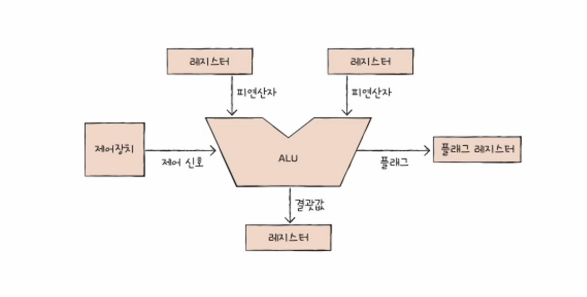
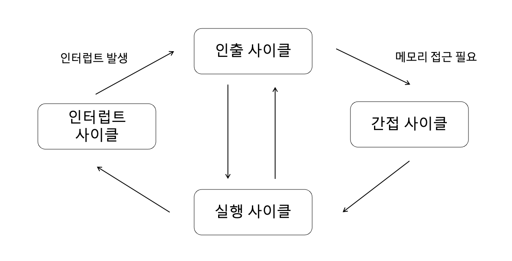

# Chap 4. CPU의 작동 원리

## 01. ALU와 제어장치

### ALU

ALU는 연산한 결과값과 플래그를 반환

ALU는 레지스터를 통해 `피연산자`를 받아들이고, 제어장치로부터 수행할 연산을 알려주는 `제어 신호`를 받아들임  
→ ALU는 레지스터와 제어장치로부터 받아들인 피연산자와 제어 신호로 산술 연산, 논리 연산 등 다양한 연산 수행

⚡️ ALU 연산 결과값은 일시적으로 **레지스터에 저장**

- CPU가 메모리에 접근하는 속도는 레지스터에 접근하는 속도보다 훨씬 느림
- 메모리에 저장하게 되면 CPU가 계속 메모리에 접근해 프로그램 실행 속도를 늦출 수 있음

⚡️ ALU는 계산 결과와 더불어 `플래그`를 반환

- 플래그 = 연산 결과에 대한 추가 정보
- 플래그는 `플래그 레지스터`라는 레지스터에 저장

| 플래그 종류           | 의미                                                                                                      | 사용 예시                                                                                                   |
| --------------------- | --------------------------------------------------------------------------------------------------------- | ----------------------------------------------------------------------------------------------------------- |
| **부호 플래그**       | 연산한 결과의 부호를 나타낸다.                                                                            | 부호 플래그가 1일 경우 계산 결과는 음수, 0일 경우 계산 결과는 양수를 의미한다.                              |
| **제로 플래그**       | 연산 결과가 0인지 여부를 나타낸다.                                                                        | 제로 플래그가 1일 경우 연산 결과는 0, 0일 경우 연산 결과는 0이 아님을 의미한다.                             |
| **캐리 플래그**       | 연산 결과 올림수나 빌림수가 발생하는 지를 나타낸다.                                                       | 캐리 플래그가 1일 경우 올림수나 빌림수가 발생했음을 의미하고, 0일 경우 발생하지 않았음을 의미한다.          |
| **오버플로우 플래그** | 오버플로우가 발생했는지를 나타낸다.                                                                       | 오버플로우 플래그가 1일 경우 오버플로우가 발생했음을 의미하고, 0일 경우 발생하지 않았음을 의미한다.         |
| **인터럽트 플래그**   | 인터럽트가 가능한지를 나타낸다. 인터럽트는 04~3에서 설정된다.                                             | 인터럽트 플래그가 1일 경우 인터럽트가 가능함을 의미하고, 0일 경우 인터럽트가 불가능함을 의미한다.           |
| **슈퍼바이저 플래그** | 커널 모드로 실행 중인지, 사용자 모드로 실행 중인지를 나타낸다. 커널 모드와 사용자 모드는 09에서 설정된다. | 슈퍼바이저 플래그가 1일 경우 커널 모드로 실행 중임을 의미하고, 0일 경우 사용자 모드로 실행 중임을 의미한다. |

 

### 제어장치

제어 신호를 내보내고, 명령어를 해석하는 부품  
제어 신호 = 컴퓨터 부품들을 관리하고 작동시키기 위한 일종의 전기 신호

⚡️ 제어장치는 CPU 구성 요소 중 가장 정교하게 설계된 부품

**[제어장치가 받아들이는 정보]**  
① 제어장치는 클럭 신호를 받아들인다.  
`클럭` : 컴퓨터의 모든 부품을 일사불란하게 움직일 수 있게 하는 시간 단위  
🚨 컴퓨터의 모든 부품이 한 클럭마다 작동하는 것이 아님 !! 하나의 명령어가 여러 클럭에 걸쳐 실행될 수 있음

② 제어장치는 '해석해야 할 명령어'를 받아들인다.  
`명령어 레지스터` = CPU가 해석해야 할 명령어가 담기는 레지스터  
제어장치는 이 명령어 레지스터로부터 해석할 명령어를 받아들이고 해석, 제어 신호를 발생시켜 컴퓨터 부품들에 수행해야 할 내용을 전달

③ 제어장치는 플래그 레지스터 속 플래그 값을 받아들인다.
플래그 값을 받아들이고 이를 참고하여 제어 신호 발생시킴

④ 제어장치는 시스템 버스, 그중에서 제어 버스로 전달된 제어 신호를 받아들인다.  
제어 신호는 CPU뿐만 아니라 입출력장치를 비롯한 CPU 외부 장치도 발생시킬 수 있음
제어장치는 제어 버스를 통해 외부로부터 전달된 제어 신호를 받아들이기도 함

**[제어장치가 내보내는 정보]**

- CPU 내부와 외부로 제어 신호를 보냄
- CPU 외부로 전달 = 제어 버스로 제어 신호를 내보냄  
   → 메모리에 전달 / 입출력장치에 전달
- CPU 내부로 전달  
   → ALU에 전달 / 레지스터에 전달

 

## 02. 레지스터

### 반드시 알아야 할 레지스터

**[프로그램 카운터]**  
메모리에서 가져올 명령어의 주소, 즉 메모리에서 읽어 들일 명령어의 주소 저장  
= `명령어 포인터`

**[명령어 레지스터]**  
해석할 명령어, 방금 메모리에서 읽어 들인 명령어를 저장  
→ 제어장치는 명령어 레지스터 속 명령어를 받아들이고 이를 해석한 뒤 제어 신호를 내보냄

**[메모리 주소 레지스터]**  
메모리 주소를 저장하는 레지스터  
CPU가 읽어 들이고자 하는 주소 값을 주소 버스로 보낼 때 메모리 주소 레지스터를 거침

**[메모리 버퍼 레지스터]**  
메모리와 주고받을 값(데이터와 명령어)를 저장하는 레지스터  
메모리에 쓰고 싶은 값이나 메모리로부터 전달받은 값은 메모리 버퍼 레지스터를 거침  
= `메모리 데이터 레지스터`

**[범용 레지스터]**  
다양하고 일반적인 상황에서 자유롭게 사용할 수 있는 레지스터  
데이터와 주소 모두 저장 가능  
일반적으로 CPU안에 여러 개의 범용 레지스터 존재

**[플래스 레지스터]**  
연산 결과 또는 CPU 상태에 대한 부가적인 정보 저장

### 특정 레지스터를 이용한 주소 지정 방식(1): 스택 주소 지정 방식

**스택 주소 지정 방식** : 스택과 스택 포인터를 이용한 주소 지정 방식  
\*스택 : LIFO  
**스택 포인터** : 스택에 마지막으로 저장한 값의 위치를 저장하는 레지스터  
**스택 영역** : 메모리 내에 스택으로 사용할 영역으로 정해진 곳

### 특정 레지스터를 이용한 주소 지정 방식(2): 변위 주소 지정 방식

오퍼랜드 필드의 값(변위)와 특정 레지스터의 값을 더하여 유효 주소를 얻어내는 주소 지정 방식  
변위 주소 지정 방식 사용 명령어 → 연산 코드 필드 + 레지스터 필드 + 오퍼랜드 필드

- 연산 코드 : 이런 내용을 수행해라
- 레지스터 : 이 레지스터 값과
- 오퍼랜드 : 이 주소를 더한 곳에 있는 데이터로

 

**[상대 주소 지정 방식]**  
오퍼랜드와 프로그램 카운터의 값을 더하여 유효 주소를 얻는 방식  
상대 주소 지정 방식은 프로그래밍 언어의 if문과 유사하게 모든 코드를 실행시키는 것이 아닌, 분기하여 특정 주소의 코드를 실행할 때 사용

**[베이스 레지스터 주소 지정 방식]**  
오퍼랜드와 베이스 레지스터의 값을 더하여 유효 주소를 얻는 방식  
베이스 레지스터 = 기준 주소  
오퍼랜드 = 기준 주소로부터 떨어진 거리  
→ 베이스 레지스터 속 기준 주소로부터 얼마나 떨어져 있는 주소에 접근할 것인지를 연산하여 유효 주소를 얻어내는 방식

 

## 03. 명령어 사이클과 인터럽트

### 명령어 사이클

프로그램 속 각각의 명령어들은 일정한 주기가 반복되며 실행, 이 주기를 `명령어 사이클`이라고 함  
각각의 명령어들은 **명령어 사이클**이 반복되며 실행

① `인출 사이클` : 메모리에 있는 명령어를 CPU로 가지고 오는 단계  
② `실행 사이클` : CPU로 가져온 명령어를 실행하는 단계  
③ `간접 사이클` : 명령어를 실행하기 위해 메모리에 한 번 더 접근해야 하는 단계

 

### 인터럽트

CPU의 작업을 방해하는 신호

- 동기 인터럽트
- 비동기 인터럽트

⚡️ **동기 인터럽트**  
CPU에 의해 발생하는 인터럽트  
CPU가 명령어들을 수행하다가 예상치 못한 상황에 마주쳤을 때 발생  
ex. 프로그래밍상의 오류와 같은 예외적인 상황  
= `예외`라고 부름

⚡️ **비동기 인터럽트**  
주로 입출력장치에 의해 발생하는 인터럽트  
ex.

- CPU가 프린터와 같은 입출력장치에 입출력 작업을 부탁하면 작업을 끝낸 입출력장치가 CPU에 **완료 알림(인터럽트)** 전송
- 키보드, 마우스와 같은 입출력장치가 어떠한 입력을 받아들였을 때 이를 처리하기 위해 CPU에 **입력 알림(인터럽트)** 전송  
  = `하드웨어 인터럽트`

 

**[하드웨어 인터럽트]**  
알림과 같은 인터럽트  
→ 입출력 작업 중에도 CPU로 하여금 효율적으로 명령어를 처리할 수 있게 함

**[하드웨어 인터럽트 처리 순서]**  
① 입출력장치는 CPU에 `인터럽트 요청 신호` 전송  
② CPU는 실행 사이클이 끝나고 명령어를 인출하기 전 항상 인터럽트 여부 확인  
③ CPU는 인터럽트 요청을 확인하고 `인터럽트 플래그`를 통해 현재 인터럽트를 받아들일 수 있는지 여부 확인  
④ 인터럽트를 받아들일 수 있다면 CPU는 지금까지의 작업 백업  
⑤ CPU는 `인터럽트 벡터`를 참조하여 `인터럽트 서비스 루틴`을 실행  
⑥ 인터럽트 서비스 루틴 실행이 끝나면 ④에서 백업해 둔 작업을 복구하여 실행 재개

`인터럽트 요청 신호` : CPU의 정상적인 실행 흐름을 끊을 때 보내는 신호  
`인터럽트 플래그` : 인터럽트 수용 여부 결정하는 플래그, CPU가 인터럽트 요청을 수용하기 위해서는 반드시 활성화  
✔️ 인터럽트 플래그로 **막을 수 있는 인터럽트**와 **막을 수 없는 인터럽트**가 존재  
`인터럽트 서비스 루틴` : CPU가 인터럽트 요청을 받아들이기로 했다면 CPU는 인터럽트 서비스 루틴이라는 프로그램 실행(=`인터럽트 핸들러`)  
✔️ 일종의 사용설명서, 각 인터럽트 별로 어떻게 실행해야하는지에 대한 설명  
`인터럽트 벡터` : 인터럽트 서비스 루틴을 식별하기 위한 정보

