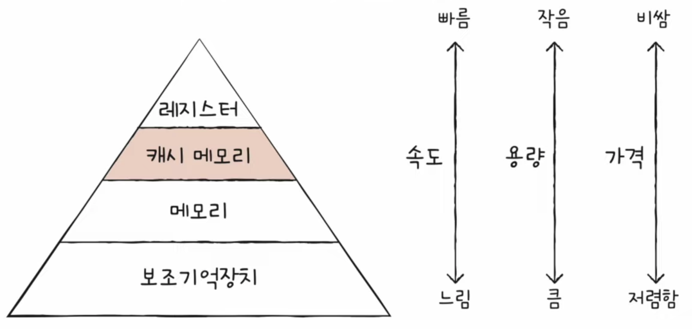
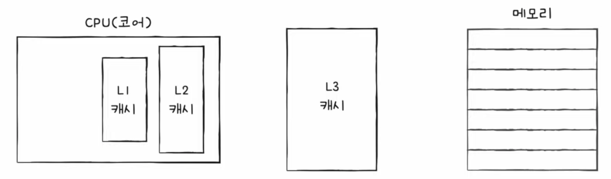

# Chap 6. 메모리와 캐시 메모리

## 01. RAM의 특징과 종류

### RAM의 특징

RAM(메모리)에는 실행할 프로그램의 명령어와 데이터 저장  
⚡️ 전원을 끄면 RAM에 저장된 명령어와 데이터가 모두 날아감! → `휘발성 저장 장치`  
⚡️ 전원이 꺼져도 저장된 내용이 유지되는 저장 장치 → `비휘발성 저장 장치`  
 ex. 하드 디스크, ssd, cd-rom, usb ...

    RAM의 특징

    RAM = 휘발성 저장 장치
    보조기억장치 = 비휘발성 저장 장치

    ✔️ 보조기억장치는 전원을 꺼도 내용을 유지, but CPU는 보조기억장치에 직접 접근하지 못함
    → 비휘발성 저장 장치(보조기억장치)에는 `보관할 대상` 저장
    → 휘발성 저장 장치(RAM)에는 `실행할 대상` 저장

### RAM의 용량과 성능

- RAM 용량이 크면 **많은 프로그램들을 동시에 실행하는데 유리**
- RAM 용량이 무지막지하게 크다고 프로그램 실행 속도가 비례해서 빨라지는 것 ❌
- 어느 정도 실행 속도가 빨라지는 것은 맞음

### RAM의 종류

**[DRAM]**  
= Dynamic RAM  
데이터가 동적으로 변하는(사라지는) RAM

- 시간이 지나면 저장된 데이터가 점차 사라짐
- 데이터 소멸을 막기 위해 일정 주기로 데이터 재활성화(다시 저장)
- 그럼에도 불구하고 일반적으로 메모리로써 사용

> ⚡️DRAM의 장점
>
> - 소비 전력이 비교적 낮음
> - 저렴
> - 집적도 높음 → 대용량으로 설계 용이

**[SRAM]**  
= Static RAM  
저장된 데이터가 변하지 않는 RAM

- 시간이 지나도 저장된 데이터가 사라지지 X
- 데이터 재활성 필요 X
- 속도도 빠름

> ⚡️SRAM의 단점
>
> - DRAM보다 집적도 낮음
> - 소비 전력 큼
> - 비쌈  
>   → 대용량으로 만들어질 필요는 없지만 속도가 빨라야 하는 저장 장치 (ex. 캐시 메모리)에서 사용

**[SDRAM]**  
Synchronous Dynamic RAM  
클럭 신호와 동기화된, 발전된 형태의 DRAM  
→ 클럭 타이밍에 맞춰 CPU와 정보를 주고받을 수 있음

**[DDR SDRAM]**  
Double Data Rate Sdram  
대역폭을 넓혀 속도를 빠르게 만든 SDRAM

- 최근 가장 흔하게 사용되는 RAM
- `대역폭` = 데이터를 주고받는 길의 너비

💡 DDR2 SDRAM, DDR3 SDRAM, DDR4 SDRAM ...  
→ 대역폭이 각각 2배씩 커지는 RAM

 

## 02. 메모리의 주소 공간

- 물리 주소 : 메모리 하드웨어가 사용하는 주소
- 논리 주소 : CPU와 실행 중인 프로그램이 사용하는 주소

### 물리 주소와 논리 주소

- 메모리가 사용하는 주소는 하드웨어상의 실제 주소인 `물리 주소`
- CPU와 실행 중인 프로그램이 사용하는 주소는 각각의 프로그램에 부여된 `논리 주소`

⚡️ CPU가 메모리와 상호작용하려면 논리 주소와 물리 주소 간의 변환이 이루어져야 함 !!  
→ 논리 주소와 물리 주소 간의 변환은 CPU와 주소 버스 사이에 위치한 `메모리 관리 장치`(MMU)라는 하드웨어에 의해 수행

> **MMU**  
> CPU가 발생시킨 논리 주소에 베이스 레지스터 값을 더하여 논리 주소를 물리 주소로 변환
>
> `베이스 레지스터` = 프로그램의 가장 작은 물리 주소  
> `논리 주소` = 프로그램의 시작점으로부터 떨어진 거리

### 메모리 보호 기법

⚡️ 다른 프로그램의 영역을 침범할 수 있는 명령어는 위험하기 때문에 논리 주소 범위를 벗어나는 명령어 실행을 방지하, 실행 중인 프로그램이 다른 프로그램에 영향을 받지 않도록 보호할 방법이 필요함 !!

**한계 레지스터**  
논리 주소의 최대 크기 저장

✔️ **프로그램의 물리 주소 범위**  
베이스 레지스터 값 이상 ~ 베이스 레지스터 + 한계 레지스터 값 미만  
⚡️ CPU가 접근하려는 논리 주소는 한계 레지스터가 저장한 값보다 크면 안됨  
CPU가 한계 레지스터보다 높은 논리 주소에 접근하려고 하면 `인터럽트(트랩)` 발생시켜 실행 중단

 

## 03. 캐시 메모리

### 저장 장치 계층 구조

① CPU와 가까운 저장 장치는 빠르고, 멀리 있는 저장 장치는 느리다.  
② 속도가 빠른 저장 장치는 저장 용량이 작고, 가격이 비싸다.

컴퓨터가 사용하는 저장 장치들은 'CPU에 얼마나 가까운가'를 기준으로 계층적으로 표현 가능  
= `저장 장치 계층 구조` memory hierarchy

- 상위 계층일수록 CPU와 가깝고 용량은 작지만 빠른 저장 장치
- 하위 계층일수록 CPU와 멀고 용량은 크지만 느린 저장 장치

 

### 캐시 메모리

CPU와 메모리 사이에 위치하고, 레지스터보다 용량이 크고 메모리보다 빠른 SRAM 기반의 저장 장치  
→ CPU의 연산 속도와 메모리 접근 속도의 차이를 조금이나마 줄이기 위해 탄생

⚡️캐시 메모리는 CPU(코어)와 가까운 순서대로 계층 구성

- L1, L2, L3 캐시 순서대로 코어랑 가까움
- 일반적ㅇ드로 L1, L2 캐시는 코어 내부, L3는 코어 외부에 위치
- 캐시 메모리 용량은 L1, L2, L3 순으로 커짐
- 속도는 L3, L2, L1 순으로 빨라짐
- 가격은 L3, L2, L1 순으로 비쌈
- CPU가 메모리 내에 데이터가 필요하다고 판단하면 L1, L2, L3 순으로 데이터 검색

> **분리형 캐시**  
> L1 캐시는 조금이라도 접근 속도를 빠르게 만들기 위해 분리형 캐시 사용  
> 명령어만 저장하는 `L1I 캐시`
> 데이터만 저장하는 `L1D 캐시`

 

### 참조 지역성 원리

- 캐시 메모리는 메모리보다 용량이 작음
- 캐시 메모리가 메모리에 있는 모든 내용 저장 X (당연)
- 캐시 메모리는 메모리의 일부를 복사하여 저장

 

보조기억장치 → 전원이 꺼져도 기억할 대상 저장  
메모리 → 실행 중인 대상 저장  
**캐시 메모리 → CPU가 사용할 법한 대상을 예측하여 저장**  
`캐시 히트` = 캐시 메모리가 예측해서 저장한 데이터가 실제로 들어맞아 CPU에서 활용되는 경우  
`캐시 미스` = 예측이 틀려 메모리에서 필요한 데이터를 직접 가져와야 하는 경우  
`캐시 적중률` = 캐시 히트 / (캐시 히트 + 캐시 미스)

⚡️ 우리가 사용하는 컴퓨터의 캐시 적중률은 대략 85~95%

**[캐시 메모리에 저장할 데이터 선정 원칙]**  
**⭐️ 참조 지역성의 원리**  
① CPU는 최근에 접근했던 메모리 공간에 다시 접근하려는 경향

- `시간 지역성` = 최근에 접근했던 메모리 공간에 다시 접근하려는 경향
- ex. 코드에서 '변수'로 지정하면 언제든 그 변수에 다시 접근해서 값을 사용할 것
- 변수를 CPU가 최근 접근했던 메모리 공간이라고 생각하면 이해하기 쉬움

② CPU는 접근한 메모리 공간 근처를 접근하려는 경향

- CPU가 실행하려는 프로그램은 보통 관련 데이터들끼리 모여 있음
- `공간 지역성` = 접근한 메모리 공간 근처를 접근하려는 경향
