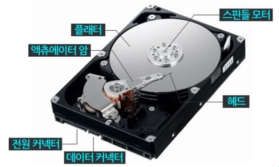
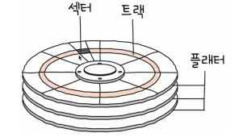
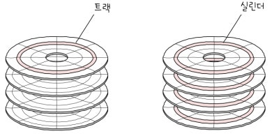
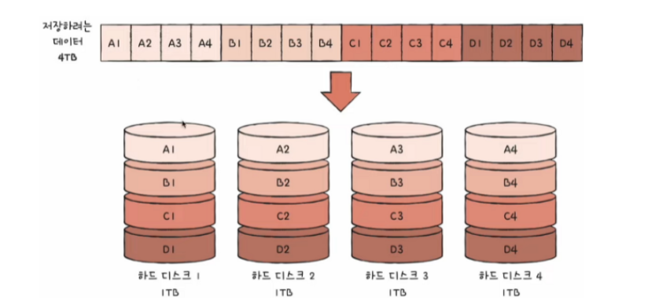
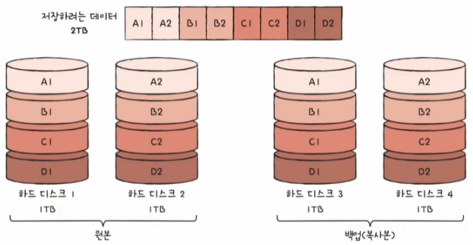
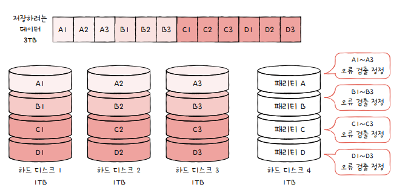
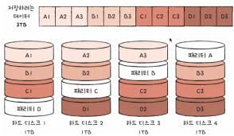
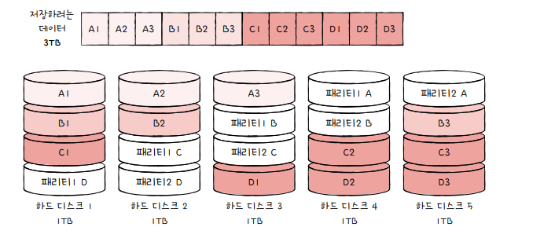

# Chap 7. 보조기억장치

## 01. 다양한 보조기억장치

### 하드 디스크

자기적인 방식으로 데이터를 저장하는 보조기억장치(=자기 디스크)

- **플래터**: 실질적으로 데이터가 저장되는 곳(원판)
- **스핀들**: 플래터를 회전시키는 구성 요소(RPM 단위로 표현)
- **헤드**: 플래터를 대상으로 데이터를 읽고 쓰는 구성 요소(바늘)
- **디스크 암**: 헤드를 원하는 위치로 이동시키는 구성 요소  
   ✲ 헤드는 디스크 암에 붙어있음

 

**[플래터]**  
  

- **트랙**: 플래터를 여러 동심원으로 나누었을 때 그중 하나의 원
- **섹터**: 여러 조각으로 나눠진 트랙 한 조각
- **블록**: 하나 이상의 섹터를 묶은 단위
- **실린더**: 여러 겹의 플래터 상에서 같은 트랙이 윛피한 곳을 모아 연결한 논리적 단위

⚡️연속된 정보는 보통 한 실린더에 기록  
→ 디스크 암을 움직이지 않고 바로 데이터에 접근할 수 있음

✔️ **하드 디스크가 데이터에 접근하는 시간**  
`탐색 시간`: 접근하려는 데이터가 저장된 트랙가지 헤드를 이동시키는 시간  
`회전 지연`: 헤드가 있는 곳으로 플래터를 회전시키는 시간  
`전송 시간`: 하드 디스크와 컴퓨터 간에 데이터를 전송하는 시간

 

### 플래시 메모리

전기적으로 데이터를 읽고 쓸 수 있는 반도체 기반의 저장 장치  
⚡️플래시 메모리는 보조기억장치 범주에만 속한다기보다는 다양한 곳에서 널리 사용하는 저장 장치는 보는 것이 맞음!

> **두 종류의 플래시 메모리**  
> `NAND 플래시 메모리`: NAND 연산을 수행하는 회로 → 대용량 저장 장치로 많이 사용  
> `NOR 플래시 메모리`: NOR 연산을 수행하는 회로  
> '플래시 메모리'는 특별한 언급이 없는 한 NAND 플래시 메모리를 지칭한다고 봐도 무방

- 셀: 플래시 메모리에서 데이터를 저장하는 가장 작은 단위
- SLC: 한 셀에 1비트 저장 플래시 메모리
- MLC: 한 셀에 2비트 저장 플래시 메모리
- TLC: 한 셀에 3비트 저장 플래시 메모리

**[SLC 타입]**  
한 셀로 두 개의 정보 표현

- MLC나 TLC 타입에 비해 비트의 빠른 입출력이 가능
- 수명도 MLC나 TLC 타입에 비해 김
- → 수만에서 수십만 번 가까이 데이터를 쓰고 지우고 반복 가능!
- 용량 대비 가격 높음  
  ⚡️ 혼자 살면 감당해야 할 주거 비용이 커지는 것과 같음

**[MLC 타입]**  
한 셀로 네 개의 정보 표현

- SLC 타입보다 일반적으로 속도와 수명은 떨어지지만, 한 셀에 두 비트씩 저장할 수 있다는 점에서 **대용량화하기 유리**
- SLC 타입에 비해 저렴
- 시중에서 사용되는 많은 플래시 메모리 저장 장치들이 MLC 타입

**[TLC 타입]**  
한 셀로 여덟 개의 정보 표현

- 대용량화 가장 유리
- 수명과 속도가 떨어지지만 용량 대비 가격이 저렴

 

### 💡 **정리**

| 구분           | SLC    | MLC  | TLC    |
| -------------- | ------ | ---- | ------ |
| 셀당 bit       | 1bit   | 2bit | 3bit   |
| 수명           | 길다   | 보통 | 짧다   |
| 읽기/쓰기 속도 | 빠르다 | 보통 | 느리다 |
| 용량 대비 가격 | 높다   | 보통 | 낮다   |

 

**[플래시 메모리의 단위]**

- `페이지`: 셀들이 모여 만들어진 단위
- `블록`: 페이지가 모여 만들어진 단위
- `플레인`: 블록이 모여 만들어진 단위
- `다이`: 플레인이 모여 만들어진 단위

플래시 메모리에서 읽기와 쓰기는 `페이지` 단위  
but, 삭제는 `블록` 단위

⚡️ 읽기/쓰기와 삭제 단위가 다르다는 것이 플래시 메모리의 가장 큰 특징

**[페이지 상태]**

- **Free 상태**: 어떠한 데이터도 저장하고 있지 않아 새로운 데이터를 저장할 수 있는 상태
- **Valid 상태**: 이미 유효한 데이터를 저장하고 있는 상태
- **Invalid 상태**: 쓰레기값이라 부르는 유효하지 않은 데이터를 저장하고 있는 상태  
  ⚡️플래시 메모리는 하드 디스크와 달리 **덮어쓰기가 불가능**, Valid 상태인 페이지에는 새 데이터 저장 불가능

> **💡가비지 컬렉션**  
> ① 유효한 페이지들만을 새로운 블록으로 복사  
> ② 기존의 블록 삭제

 

## 02. RAID의 정의와 종류

### RAID의 정의

데이터의 안전성 혹은 높은 성능을 위해 여러 개의 물리적 보조기억장치를 마치 하나의 논리적 보조기억장치처럼 사용하는 기술  
주로 하드 디스크와 SSD를 사용하는 기술

### RAID의 종류

`RAID 레벨` = RAID 구성 방법  
→ RAID 0 ~ RAID 6 (RAID 2,3은 현재 잘 활용 X)

**[RAID 0]**  
여러 개의 보조기억장치에 데이터를 단순히 나누어 저장하는 구성 방식

- `스트라입`: 줄무늬처럼 분산되어 저장된 데이터
- `스트라이핑`: 분산하여 저장하는 행위
- 데이터가 스트라이핑되면 저장된 데이터를 읽고 쓰는 속도가 빨라짐

🚨 **단점**

- 저장된 정보가 안전하지 x
- RAID 0으로 구성된 하드 디스크 중 하나에 문제가 생기면 다른 모든 하드 디스크의 정보를 읽는데 문제가 생길 수 있음
- 그래서 RAID 1이 등장!

 

**[RAID 1]**  
복사본을 만드는 방식(=`미러링`)

- 데이터를 원본과 복사본 두 군데에 저장 → RAID 0보다 느림
- 복구가 매우 간단!

🚨 **단점**

- 하드 디스크 개수가 한정되었을 때 사용 가능한 용량이 적어짐
- 많은 양의 하드 디스크가 필요하게 되면서 **비용 증가**

 

**[RAID 4]**  
복사본을 만드는 대신 오류를 검출하고 복구하기 위한 정보를 저장한 장치를 두는 구성 방식  
`패리티 비트` = 오류를 검출하고 복구하기 위한 정보

- 패리티를 저장한 장치를 이용해 다른 장치들의 오류를 검출, 오류가 있으면 복구
- RAID 1보다 적은 하드 디스크로 데이터를 안전하게 보관

> **오류를 검출하는 패리티 비트**  
> 원래 패리티 비트는 오류 검출만 가능(복구 불가)  
> but, RAID에서는 패리티 값으로 오류 수정도 가능  
> ① RAID 4에서는 패리티 정보를 저장한 장치로써 나머지 장치들의 오류를 검출, 복구  
> ② 패리티 비트는 본래 오류 검출용 정보지만, RAID에서는 오류 복구도 가능

🚨 **단점**

- 어떤 새로운 데이터가 저장될 때마다 패리티를 저장하는 디스크에도 데이터를 쓰게 됨
- → 패리티를 저장하는 장치에 **병목 현상 발생**

 

**[RAID 5]**  
패리티 정보를 분산하여 저장하는 방식

💡 **RAID4 & RAID 5**

- RAID 4: 패리티를 저장한 장치를 따로 두는 방식
- RAID 5: 패리티를 분산하여 저장하는 방식

 

**[RAID 6]**  
기본적으로 RAID 5와 같은 구성, 서로 다른 두개의 패리티를 두는 방식

- 오류를 검출하고 복구할 수 있는 수단이 2개

🚨 **단점**

- 새로운 정보를 저장할 때마다 함께 저장할 패리티가 두 개
- → RAID 5보다 쓰기 속도가 느림

➡️ RAID 6은 저장 속도가 느리더라도 데이터를 더욱 안전하게 보관하고 싶을 때 사용하는 방식
