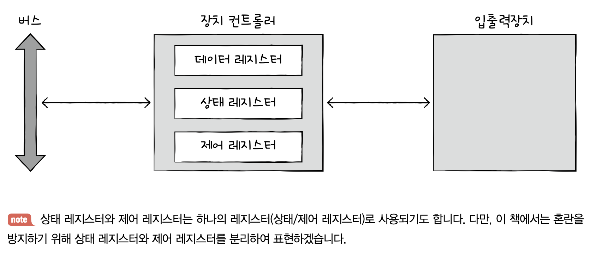
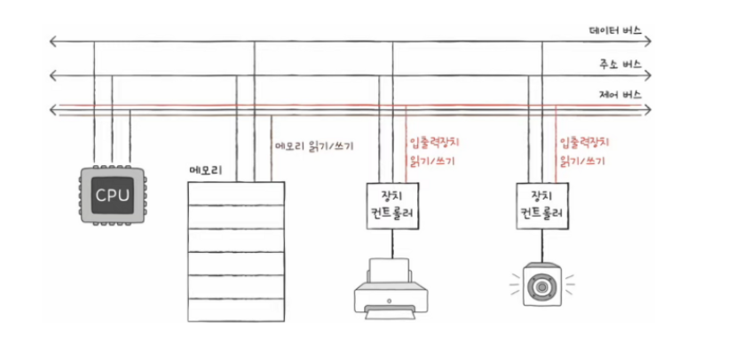

# Chap 8. 입출력장치

## 01. 장치 컨트롤러와 장치 드라이버

### 장치 컨트롤러

입출력장치가 다루기 까다로운 이유  
① 입출력장치는 종류가 매우 많음  
→ 다양한 입출력장치와 정보를 주고받는 방식을 규격화하기 어려움

② 일반적으로 CPU와 메모리의 데이터 전송률은 높지만 입출력장치의 데이터 전송률은 낮음  
`전송률` = 데이터를 얼마나 빨리 교환할 수 있는지를 나타내는 지표

➡️ 입출력장치는 컴퓨터에 직접 연결되지 않고 `장치 컨트롤러`라는 하드웨어를 통해 연결

모든 입출력장치는 각자의 장치 컨트롤러를 통해 컴퓨터 내부와 정보를 주고 받음  
장치 컨트롤러는 하나 이상의 입출력장치와 연결

- CPU와 입출력장치 간의 통신 중개
- 오류 검출
- 데이터 버퍼링

> 데이터 버퍼링이란?  
> `버퍼링` = 전송률이 높은 장치와 낮은 장치 사이에 주고받는 데이터를 `버퍼`라는 임ㅁ시 저장 공간에 저장하여 전송률을 비슷하게 맞추는 방법

**[장치 컨트롤러의 내부 구조]**

**[데이터 레지스터]**  
CPU와 입출력장치 사이에 주고받을 데이터가 담기는 레지스터  
데이터 버퍼링에서 `버퍼` 역할

**[상태 레지스터]**  
입출력장치의 입출력 작업 준비, 완료, 오류 등의 상태 정보가 저장

**[제어 레지스터]**  
입출력장치가 수행할 내용에 대한 제어 정보와 명령 저장

 

### 장치 드라이버

장치 컨트롤러의 동작을 감지하고 제어함으로써 장치 컨트롤러가 컴퓨터 내부와 정보를 주고받을 수 있게 하는 프로그램

> 장치 컨트롤러 → 입출력장치를 연결하기 위한 **하드웨어적인 통로**  
> 장치 드라이버 → 입출력장치를 연결하기 위한 **소프트웨어적인 통로**

 

## 02. 다양한 입출력 방법

### 프로그램 입출력

기본적으로 프로그램 속 명령어로 입출력장치를 제어하는 방법  
→ CPU가 프로그램 속 명령어를 실행하는 과정에서 입출력 명령어를 만나면 CPU는 입출력장치에 연결된 장치 컨트롤러와 상호작용하며 입출력 작업 수행

**[메모리 맵 입출력]**  
메모리에 접근하기 위한 주소 공간과 입출력장치에 접근하기 위한 주소 공간을 하나의 주소 공간으로 간주하는 방법

⭐️ 메모리 맵 입출력 방식에서 CPU는 메모리의 주소들이나 장치 컨트롤러의 레지스터들이나 모두 똑같이 메모리 주소를 대하듯 하면 됨 !  
→ 메모리에 접근하는 명령어와 입출력장치에 접근하는 명령어가 굳이 다를 필요 X

**[고립형 입출력]**  
메모리를 위한 주소 공간과 입출력장치를 위한 주소 공간을 분리하는 방법

- 제어 버스에 '메모리 읽기/쓰기'선과 '입출력장치 읽기/쓰기' 선이 따로 존재
- → 메모리 선이 활성화되는 명령어를 실행할 때는 메모리에 접근, 입출력장치 선이 활성화되는 명령어를 실행할 때는 장치 컨트롤러에 접근

⭐️ CPU는 입출력장치에 접근하기 위해 메모리에 접근하는 명령어와는 다른 입출력 명령어 사용

 

### 인터럽트 기반 입출력

입출력장치에 의한 하드웨어 인터럽트는 정확히 말하자면 입출력장치가 아닌 `장치 컨트롤러`에 의해 발생  
**[인터럽트 기반 입출력 과정]**  
① CPU는 장치 컨트롤러에 입출력 작업 명령  
② 장치 컨트롤러가 입출력장치를 제어하며 입출력을 수행하는 동안 CPU는 다른 일 수행  
③ 장치 컨트롤러가 입출력 작업을 끝낸 뒤 CPU에게 인터럽트 요청 신호 전송  
④ CPU는 하던 일을 잠시 백업, 인터럽트 서비스 루틴 실행

> **폴링**  
> 입출력장치의 상태는 어떤지, 처리할 데이터가 있는지를 주기적으로 확인하는 방식
>
> - 인터럽트와 자주 비교되는 개념
> - 폴링 방식은 당연하게도 인터럽트 방식보다 CPU 부담이 큼
> - 인터럽트를 활용하면 CPU가 인터럽트 요청을 받을 때까지 온전히 다른 일에 집중할 수 있기 때문

 

**⚡️ 여러 입출력장치에서 인터럽트가 동시에 발생한 경우?!**  
플래그 레지스터의 인터럽트 비트(인터럽트 플래그)를 비활성화 하면 순차적으로 실행 but, 모든 인터럽트를 순차적으로 해결할 수는 없음  
→ 인터럽트 간에 **우선순위를 고려하여 처리**

> **NMI** Non-Maskable Interrupt  
> 플래그 레지스터 속 인터럽트 비트가 활성화되어 있는 경우, 혹은 인터럽트 비트를 비활성화해도 무시할 수 없는 인터럽트

**프로그래머블 인터럽트 컨트롤러(PIC)**  
여러 장치 컨트롤러에 연결되어 장치 컨트롤러에서 보낸 하드웨어 인터럽트 요청들의 우선순위를 판별한 뒤 CPU에 지금 처리해야 할 하드웨어 인터럽트는 무엇인지 알려주는 장치

**[PIC의 다중 인터럽트 처리 과정]**  
① PIC가 장치 컨트롤러에서 `인터럽트 요청 신호` 수신  
② PIC는 인터럽트 우선순위를 판단한 뒤 CPU에 처리해야 할 `인터럽트 요청 신호` 전송  
③ CPU는 PIC에 `인터럽트 확인 신호` 전송  
④ PIC는 데이터 버스를 통해 CPU에 `인터럽트 벡터` 전송  
⑤ CPU는 인터럽트 벡터를 통해 인터럽트 요청의 주체를 알게 되고, 해당 장치의 `인터럽트 서비스 루틴` 실행  
⚡️ 일반적으로 더 많고 복잡한 장치들의 인터럽트를 관리하기 위해 PIC를 두 개 이상 계층적으로 구성

 

### DMA 입출력

입출력장치와 메모리가 CPU를 거치지 않고 상호작용할 수 있는 입출력 방식

⚡️ 프로그램 기반 입출력과 인터럽트 기반 입출력은 CPU를 거치기 때문에 가뜩이나 바쁜 CPU가 입출력장치를 위한 연산 때문에 시간을 뺏기게 됨  
→ Direat Memory Access (DMA) = 직접 메모리에 접근할 수 있는 입출력 기능  
DMA 입출력을 하기 위해서는 시스템 버스에 연결된 `DMA 컨트롤러` 필요

**[DMA 입출력 과정]**  
① CPU는 DMA 컨트롤러에 입출력장치의 주소, 수행할 연산(읽기/쓰기), 읽거나 쓸 메모리의 주소 등과 같은 정보로 입출력 작업 명령  
② DMA 컨트롤러는 CPU 대신 장치 컨트롤러와 상호작용하며 입출력 작업 수행  
 이때, DMA 필요한 경우 메모리에 직접 접근하여 정보 Read & Write  
③ 입출력 작업이 끝나면 DMA 컨트롤러는 CPU에 인터럽트를 걸어 작업 끝났음을 알림

⚡️ DMA의 시스템 버스 이용 방법

- CPU가 시스템 버스를 이용하지 않을 때마다 조금씩 이용
- CPU가 일시적으로 시스템 버스를 이용하지 않도록 허락을 구하고 집중적으로 이용  
  → `사이클 스틸링` = DMA의 시스템 버스 이용

**[입출력 버스]**  
DMA가 시스템 버스를 너무 자주 사용하면 CPU가 시스템 버스를 사용하지 못하는 문제가 발생  
→ DMA 컨트롤러와 장치 컨트롤러들을 `입출력 버스`라는 별도의 버스에 연결하여 해결 !
