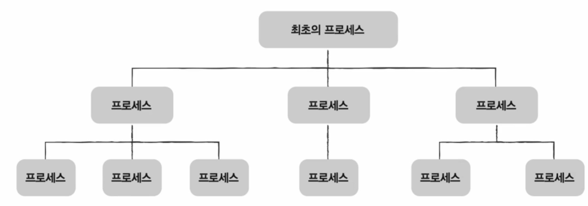

# Chap 9. 운영체제 시작하기

## 01. 운영체제를 알아야 하는 이유

### 운영체제란

모든 프로그램은 하드웨어 필수 !!  
`시스템 자원(=자원)` = 프로그램 실행에 마땅히 필요한 요소들  
ex. CPU, 메모리, 보조기억장치, 입출력장치 등.. 모든 컴퓨터 부품들

⚡️ 모든 프로그램은 실행되기 위해 반드시 `자원`이 필요 !

#### 운영체제

실행할 프로그램에 필요한 자원을 할당하고, 프로그램이 올바르게 실행되도록 돕는 특별한 프로그램  
운영체체도 메모리에 적재

⭐️ 운영체제는 매우 특별한 프로그램  
→ 컴퓨터가 부팅될 때 메모리 내 `커널 영역`이라는 공간에 따로 적재되어 실행

> **메모리 영역**  
> `커널 영역` : 운영체제가 적재되는 영역  
> `사용자 영역` : 커널 영역을 제외한 나머지 영역, 사용자가 이용하는 응용 프로그램이 적재되는 영역  
> → 운영체제는 커널 영역에 적재되어 사용자 영역에 적재된 프로그램들에 자원을 할당하고 이들이 올바르게 실행되도록 도움

### 운영체제를 알아야하는 이유

운영체제는 개발자의 프로그램이 하드웨어 상에서 어떠헥 작동하는지를 자세히 알고 있음  
➡️ 운영체제를 알면 `문제 해결 능력`이 상승

 

## 02. 운영체제의 큰 그림

운영체제는 사용자를 위한 프로그램이 아니라, 사용자가 실행하는 프로그램을 위한 프로그램

### 운영체제의 심장, 커널

**커널**
운영체제의 **핵심 서비스**를 담당하는 부분

- 자원에 접근하고 조작하는 기능,
- 프로그램이 올바르고 안전하게 실행되게 하는 기능

`사용자 인터페이스` = 윈도우의 바탕화면과 같이 사용자가 컴퓨터와 상호작용할 수 있는 통로  
\*사용자 인터페이스는 커널에 포함되지 않은 서비스

- 그래픽 유저 인터페이스(GUI)
- 커맨드 라인 인터페이스(CLI)

### 이중 모드와 시스템 호출

운영체제는 사용자가 실행하는 응용 프로그램이 하드웨어 자원에 직접 접근하는 것을 방지하여 자원을 보호

**이중 모드**  
CPU가 명령어를 실행하는 모드를 크게 사용자 모드와 커널 모드로 구분하는 방식  
✔️ 사용자 모드  
운영체제 서비스를 제공받을 수 없는 실행 모드  
→ 일반적으로 응용 프로그램은 사용자 모드로 실행, 자원 접근 불가

✔️ 커널 모드  
운영체제 서비스를 제공받을 수 있는 실행 모드  
→ 자원 접근 가능

**시스템 호출**  
사용자 모드로 실행되는 프로그램이 운영체제 서비스를 제공받기 위해 보내는 요청  
→ 일종의 인터럽트 `소프트웨어적 인터럽트`

### 운영체제의 핵심 서비스

**[프로세스 관리]**  
`프로세스` = 실행 중인 프로그램  
CPU는 한 프로세스를 실행하다가 다른 프로세스로 실행을 전환하는 것을 반복  
각 프로세스는 사용하는 자원이 모두 다름  
→ 운영체제는 다양한 프로세스를 일목요연하게 관리하고 실행

**[자원 접근 및 할당]**  
**CPU**  
운영체제는 프로세스들에 공정하게 CPU를 할당하기 위해 `CPU 스케줄링` 실행

**메모리**  
운영체제는 새로운 프로세스가 적재될 때마다 어느 주소에 적재해야 할지 결정

**입출력장치**  
운영체제는 인터럽트를 처리하는 프로그램, 인터럽트 서비스 루틴을 제공함으로써 입출력 작업 수행

**[파일 시스템 관리]**  
운영체제는 파일 열고, 생성하고, 삭제하고 관리하는 역할도 수행

 

# Chap 10. 프로세스와 스레드

## 01. 프로세스 개요

### 프로세스 직접 확인하기

**포그라운드 프로세스**: 사용자가 보는 앞에서 실행  
**백그라운드 프로세스**: 사용자가 보지 못하는 뒤편에서 실행

- 데몬 : 유닉스에서 사용자 상호작용 없는 백그라운드 프로세스
- 서비스 : 윈도우에서 사용자 상호작용 없는 백그라운드 프로세스

### 프로세스 제어 블록

운영체제는 빠르게 번갈아 수행되는 프로세스의 실행 순서 관리, 프로세스에 CPU를 비롯한 자원 배분  
이를 위해 `프로세스 제어 블록(PCB)` 이용

- 프로세스와 관련된 정보 저장 자료 구조
- 커널 영역에 생성
- 특정 프로세스 식별, 해당 프로세스 처리하는데 필요한 정보 판단
- 프로세스 생성 시에 만들어지고 끝나면 폐기

**[프로세스 ID]**  
PID = 특정 프로세스를 식별하기 위해 부여하는 고유 번호

**[레지스터 값]**  
프로세스는 자신의 실행 차례가 돌아오면 이전까지 사용했던 레지스터의 중간값들 모두 복원  
→ 이전까지 진행했던 작업을 이어할 수 있음  
PCB 안에는 해당 프로세스가 실행하며 사용했던 프로그램 카운터를 비롯한 레지스터 값들이 담김

**[프로세스 상태]**  
대기, 실행 등의 상태 정보

**[CPU 스케줄링 정보]**  
언제, 어떤 순서로 CPU를 할당받을지에 대한 정보

**[메모리 관리 정보]**  
프로세스가 어느 주소에 저장되어 있는지에 대한 정보  
베이스 레지스터, 한계 레지스터 값, 페이지 테이블 정보들도 담김

**[사용한 파일과 입출력장치 목록]**  
어떤 입출력장치가 이 프로세스에 할당되었는지, 어떤 파일들을 열었는지에 대한 정보

⚡️운영체제는 커널 영역에 적재된 PCB를 보고 프로세스 관리

### 문맥 교환

**문맥**  
하나의 프로세스 수행을 재개하기 위해 기억해야 할 정보  
→ 하나의 프로세스 문맥은 해당 프로세스의 PCB에 표현

**문맥 교환 context switching**  
기존 프로세스의 문맥을 PCB에 백업하고 새로운 프로세스를 실행하기 위해 문맥을 PCB로부터 복구하여 새로운 프로세스를 실행하는 것

- 문맥 교환은 여러 프로세스가 끊임없이 빠르게 번갈아 가며 실행되는 원리
- 문맥 교환이 자주 일어나면 프로세스는 그만큼 빨리 번갈아 가며 수행되기 때문에 프로세스들이 동시에 실행되는 것처럼 보임
- 문맥 교환이 너무 자주 일어나면 오버헤드 발생 가능성

### 프로세스 메모리 영역

**[코드 영역]**  
실행할 수 있는 코드, 즉 기계어로 이루어진 명령어 저장  
데이터가 아닌 CPU가 실행할 명령어가 담겨 있기 때문에 **쓰기 금지**  
→ **읽기 전용 공간**

**[데이터 영역]**  
프로그램이 실행되는 동안 유지할 데이터가 저장되는 공간  
ex. 전역 변수

⚡️코드 영역과 데이터 영역은 크기가 변화 X `정적 할당 영역`  
→ 프로그램을 구성하는 명령어들이 갑자기 바뀔 일은 없고, 데이터 영역에 저장될 내용은 프로그램이 실행되는 동안에만 유지될 데이터기 때문

**[힙 영역]**  
프로그램을 만드는 사용자, 즉 프로그래머가 직접 할당할 수 있는 저장 공간

- 프로그래밍 과정에서 힙 영역에 메모리 공간을 할당했다면 언젠가는 해당 공간 반환 필수 !
- 메모리 공간 반환 = 더 이상 메모리 공간 사용 X라고 운영체제에 전달하는 것
- `메모리 누수` = 메모리 반환이 이루어지지 않ㅇ라 메모리 내에 계속 남아 메모리를 낭비하는 문제

**[스택 영역]**  
데이터를 일시적으로 저장하는 공간  
ex. 매개 변수, 지역 변수

⚡️힙 영역과 스택 영역은 실시간으로 크기가 변할 수 있기 때문에 `동적 할당 영역`
일반적으로 힙 영역은 메모리의 낮은 주소에서 높은 주소로 할당, 스택 영역은 높은 주소에서 낮은 주소로 할당  
→ 힙 영역과 스택 영역에 데이터가 쌓여도 새롭게 할당되는 주소가 겹치지 않음

 

## 02. 프로세스 상태와 계층 구조

### 프로세스 상태

**[생성 상태]**  
프로세스를 생성 중인 상태  
→ 이제 막 메모리에 적재되어 PCB를 할당 받은 상태

**[준비 상태]**  
당장이라도 CPU를 할당받아 실행할 수 있지만, 차례를 기다리는 상태

**[실행 상태]**  
CPU를 할당받아 실행 중인 상태  
→ 타이머 인터럽트(프로세스에 할당된 시간이 다됐을 때 발생하는 인터럽트)가 발생하면 다시 준비 상태로 변경

⚡️ 준비 상태인 프로세스가 실행 상태로 전환되는 것 = `디스패치`

**[대기 상태]**  
프로세스 실행 도중 입출력장치 사용하는 경우, 입출력장치의 실행이 끝날 때까지 기다리는 상태  
입출력 작어빙 완료되면 해당 프로세스는 다시 준비 상태로 전환

**[종료 상태]**  
프로세스가 종료된 상태  
→ 운영체제는 PCB와 프로세스가 사용한 메모리 정리

**[프로세스 상태 다이어그램]**  

### 프로세스 계층 구조

프로세스는 실행 도중 시스템 호출을 통해 다른 프로세스 생성 가능

- 부모 프로세스 : 새 프로세스 생성한 프로세스
- 자식 프로세스 : 부모 프로세스에 의해 생성된 프로세스

**[프로세스 계층 트리 구조]**  

### 프로세스 생성 기법

**복제와 옷 갈아입기**  
부모 프로세스를 통해 생성된 자식 프로세스들이 실행되는 과정

**fork & exec (시스템 호출)**  
① 부모 프로세스는 `fork`를 통해 자신의 복사본 자식 프로세스를 생성  
② 자식 프로세스는 부모 프로세스의 복사본이기 때문에 부모 프로세스의 자원들 상속  
③ 자식 프로세스는 `exec`를 통해 새로운 프로그램으로 전환  
→ 메모리 공간에 새로운 프로그램 내용이 덮어 써진다는 점에서 자식 프로세스가 "새로운 옷"으로 갈아입었다고 볼 수 있음

> **fork** = 자기 자신 프로세스의 복사본을 자식 프로세스로 생성하는 시스템 호출  
> **exec** = 자신의 메모리 공간을 새로운 프로그램으로 덮어쓰는 시스템 호출

 

## 03. 스레드

### 프로세스와 스레드

**단일 스레드 프로세스**  
프로세스가 하나의 실행 흐름을 가지고 한 번에 하나의 부붐나 실행되는 프로세스  
→ 실행의 흐름 단위가 하나

**멀티 스레드 프로세스**  
`스레드` 개념이 도입되면서 하나의 프로세스가 한 번에 여러 일을 동시에 처리할 수 있게 됨  
→ 프로세스를 구성하는 여러 명령어를 동시에 실행

⚡️프로세스의 스레드들은 실행에 필요한 최소한의 정보만을 유지한 채 프로세스 자원을 공유하며 실행  
**프로세스 자원을 공유**한다는 것이 스레드의 핵심 !!!

 

### 멀티프로세스와 멀티스레드

**멀티프로세스** = 여러 프로세스를 동시에 실행하는 것  
**멀티스레드** = 여러 스레드로 프로세스를 동시에 실행하는 것

✔️ 단일 스레드 프로세스 여러 개를 실행하는 것보다 **멀티 스레드로 하나의 프로세스를 실행하는 것이 좋은 이유**  
= 스레드는 프로세스 **자원을 공유**하기 때문에 낭비가 적음

