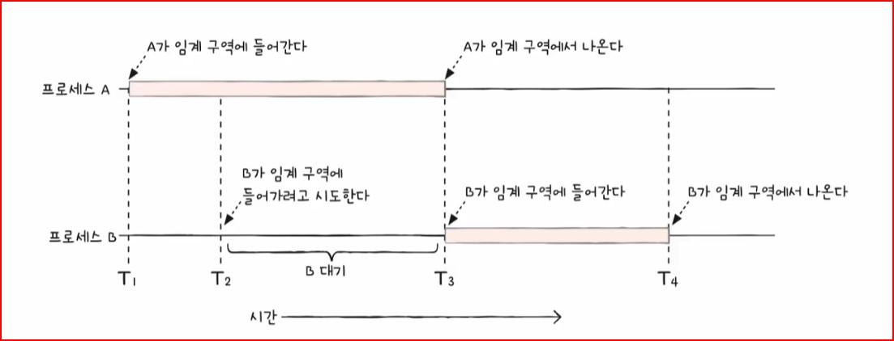
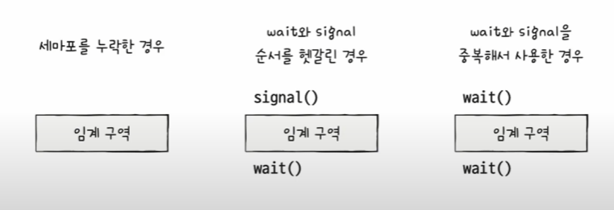
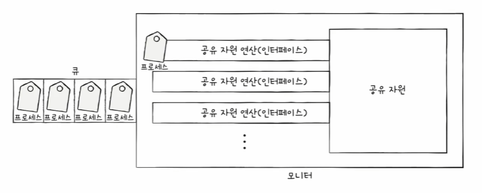
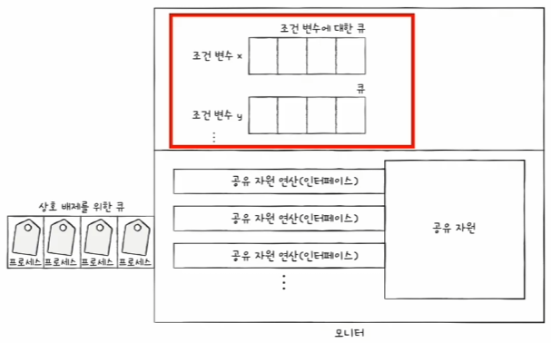
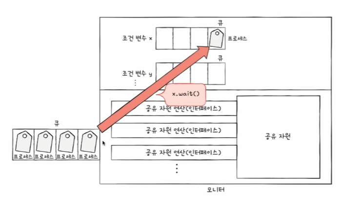
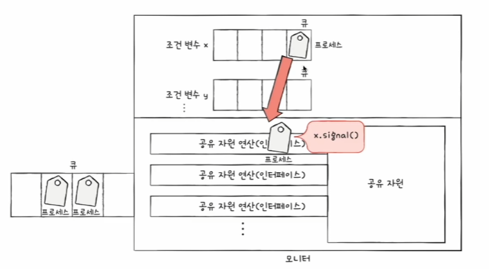

# Chap.12 프로세스 동기화

## 01. 동기화란

### 동기화의 의미

- 동시다발적으로 실행되는 많은 프로세스는 서로 데이터를 주고받으며 협력하며 실행될 수 있음
- 협력적으로 실행되는 프로세스들은 아무렇게나 마구 동시에 실행해서는 안됨

**프로세스 동기화**  
프로세스들 사이의 수행 시기를 맞추는 것을 의미

- **실행 순서 제어**: 프로세스를 올바른 순서대로 실행하기
- **상호 배제**: 동시에 접근해서는 안되는 자원에 하나의 프로세스만 접근하게 하기

✽ 프로세스뿐만 아니라 스레드도 동기화 대상, `실행의 흐름`을 갖는 모든 것은 동기화의 대상

**① 실행 순서 제어를 위한 동기화**  
동시에 실행되는 프로세스를 올바른 순서대로 실행하는 것이 첫 번째 프로세스 동기화

**② 상호 배제를 위한 동기화**  
동시에 접근해서는 안되는 자원에 동시에 접근하지 못하게 하는 것  
`상호 배제` = 공유가 불가능한 자원의 동시 사용을 피하기 위해 사용하는 알고리즘

### 생산자와 소비자 문제

- 생산자와 소비자는 `총합`이라는 데이터를 동시에 사용
- 소비자가 생산자의 작업이 끝나기 전에 총합을 수정하거나 생산자가 소비자의 작업이 끝나기 전에 총합을 수정하는 경우 문제 발생
- → 계좌 잔액 문제와 소비자 문제는 동시에 접근하면 안되는 자원에 동시에 접근해서 발생한 문제

### 공유 자원과 임계 구역

`공유 자원` = 동시에 실행되는 프로세스들의 공동 자원  
→ 전역 변수, 파일, 입출력장치, 보조기억장치 등

**임계 구역**  
동시에 실행하면 문제가 발생하는 자원에 접근하는 코드 영역  
ex. 계좌 잔액 문제에서 `잔액`, 생산자 소비자 문제에서 `총합`



**레이스 컨디션**  
잘못된 실행으로 인해 여러 프로세스가 동시 다발적으로 임계 구역의 코드를 실행하여 문제가 발생하는 경우  
→ 발생시 계좌 잔액 문제나 생산자와 소비자 문제처럼 데이터의 일관성이 깨짐

**[운영체제가 임계 구역 문제를 해결하는 원칙]**

- **상호 배제**: 한 프로세스가 임계 구역에 진입했다면 다른 프로세스는 임계 구역에 들어올 수 없다.
- **진행**: 임계 구역에 어떤 프로세스도 진입하지 않았다면 임계 구역에 진입하고자 하는 프로세스는 들어갈 수 있어야 한다.
- **유한 대기**: 한 프로세스가 임계 구역에 진입하고 싶다면 그 프로세스는 언젠가는 임계 구역에 들어올 수 있어야 한다.

## 02. 동기화 기법

### 뮤텍스 락

- 동시에 접근해서는 안 되는 자원에 동시에 접근하지 않도록 만드는 도구
- 상호 배제를 위한 동기화 도구
- 임계 구역에 진입하는 프로세스는 '내가 지금 임계 구역에 있음'을 알리기위해 `뮤텍스 락` 이용
- 다른 프로세스는 임계 구역이 잠겨 있으면 대기, 잠겨 있지 않으면 진입

> 뮤텍스 락
>
> - 자물쇠 역할: 프로세스들이 공유하는 전역 변수 `lock`
> - 임계 구역을 잠그는 역할: `acquire` 함수
> - 임계 구역의 잠금을 해제하는 역할: `release` 함수

**[acquire 함수]**  
프로세스가 임계 구역에 진입하기 전에 호출하는 함수

- 임계 구역이 열릴 때까지 임계 구역 반복적으로 확인
- 임계 구역이 열려 있으면 임계 구역을 잠그는 함수

**[release 함수]**  
임계 구역에서의 작업이 끝나고 호출하는 함수

- 현재 잠긴 임계 구역을 열어주는 함수

➡️ acquire와 release 함수를 아래와 같이 임계 구역 전후로 호출함으로써 하나의 프로세스만 임계 구역에 진입 가능

```
acquire() {
    while (lock == true)
        ;
    lock = true;
}

release() {
    lock = false;
}
```

✽ acquire 함수를 보면 임계 구역이 잠겨 있을 경우 프로세스는 반복적으로 lock을 확인

```
while (lock == true)
    ;
```

→ `바쁜 대기`

### 세마포

- 뮤텍스 락과 비슷하지만 조금 더 일반화된 방식의 동기화 도구
- 공유자원이 여러 개 있는 상황에서도 적용이 가능한 동기화 도구
- 프로세스는 임계 구역 앞에서 멈춤 신호를 받으면 잠시 대기, 가도 좋다는 신호를 받으면 진입

> 세마포
>
> - 임계 구역에 진입할 수 있는 프로세스의 개수(사용 가능한 공유 자원의 개수)를 나타내는 `전역 변수 S`
> - 임계 구역에 들어가도 좋은지, 기다려야 할지를 알려주는 `wait 함수`
> - 임계 구역 앞에서 기다리는 프로세스에 '이제 가도 좋다'고 신호를 주는 `signal 함수`

<br>

```
wait () {
    while (S <= 0)
        ;
    S--;
}
```

[wait 함수 진행 과정]  
① 임계 구역에 진입할 수 있는 프로세스 개수 S가 0 이하인 경우,  
② 사용할 수 있는 자원이 있는지 반복적으로 확인하고  
③ 임계 구역에 진입할 수 있는 프로세스의 개수가 하나 이상이면 S 1 감소, 임계 구역 진입

```
signal() {
    S++;
}
```

[signal 함수 진행 과정]  
① 임계 구역에서의 작업을 마친 뒤 S 1증가

⚡️ 뮤텍스 락과 세마포의 공통적인 문제점  
→ 사용할 수 있는 공유 자원이 없는 경우 바쁜 대기를 무한정 반복해야 함, `CPU 주기 낭비`

💡 이를 해결하기 위해 **세마포가 사용하는 방법**

```
wait () {
    S--;
    if(S < 0) {
        add this process to Queue;
        sleep();
    }
}
```

① 해당 프로세서의 PCB를 대기 큐에 삽입  
② 대기 상태 전환

```
signal() {
    S++;
    if (S <= 0) {
        remove a process p from Queue;
        wakeup(p);
    }
}
```

① 대기 큐에 있는 프로세스 p 제거  
② 프로세스 p를 준비 상태로 전환

**[세마포를 이용해 프로세스의 순서를 제어하는 방법]**  
세마포 변수의 S를 0으로 두고 먼저 실행할 프로세스 뒤에 signal(), 다음에 실행할 프로세스 앞에 wait()

### 모니터

- 세마포는 매번 임계 구역 앞 뒤로 일일이 wait(), signal() 명시, 번거로움  
  

세마포의 한계를 극복하기 위해 등장한 동기화 도구 `모니터`

- 공유 자원과 공유 자원에 접근하기 위한 인터페이스(통로)를 묶어 관리
- 프로세스는 반드시 인터페이스를 통해서만 공유 자원에 접근
- 모니터를 통해 공유 자원에 접근하고자 하는 프로세스를 큐에 삽입
- 큐에 삽입된 순서대로 하나씩 공유 자원을 이용하도록 함

➡️ 모니터는 공유 자원을 다루는 인터페이스에 접근하기 위한 큐를 만들고, 모니터 안에 항상 하나의 프로세스만 들어오도록 하여 상호 배제를 위한 동기화 제공



<br>

모니터는 세마포와 마찬가지로 **실행 순서 제어를 위한 동기화**도 제공  


내부적으로 **조건 변수** 이용

> `조건 변수` = 특정 조건을 바탕으로 프로세스를 실행하고 일시 중단하기 위해 사용하는 변수  
> 조건 변수는 프로세스나 스레드의 실행 순서를 제어하기 위해 사용하는 특별한 변수



프로세스를 대기 상태로 변경, 조건 변수에 대한 큐에 삽입할 때 사용



wait()으로 대기 상태가 된 조건 변수를 실행 상태로 전환

⚡️ 모니터 안에는 하나의 프로세스만이 존재 가능!

모니터는 조건 변수를 이용하여 실행 순서 제어를 위한 동기화 제공  
① 특정 프로세스가 아직 실행될 조건이 되지 않았을 때에는 wait를 통해 실행 중단  
② 특정 프로세스가 실행될 조건이 충족되었을 때에는 signal을 통해 실행 재개
