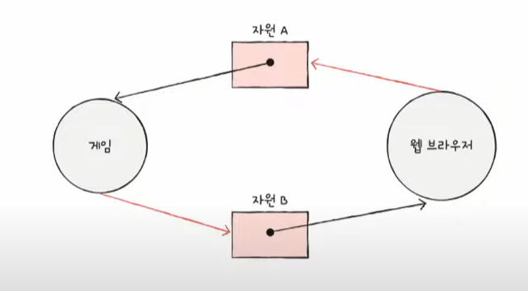

# Chap 13. 교착 상태

## 01. 교착 상태란

## 식사하는 철학자 문제

교착 상태를 설명하기 위한 아주 고전적이고 재미있는 문제 상황

일어나지 않을 사건을 기다리며 진행이 멈춰 버리는 현상 `교착 상태 deadlock`

### 자원 할당 그래프

어떤 프로세스가 어떤 자원을 사용하고 있고, 어떤 프로세스가 어떤 자원을 기다리고 있는지를 표현하는 간단한 그래프

① 프로세스는 원, 자원의 종류는 사각형으로 표현  
② 사용할 수 있는 자원의 개수는 자원 사각형 내에 점으로 표현  
③ 프로세스가 어떤 자원을 할당받아 사용 중이라면 자원에서 프로세스를 향해 화살표 표시  
④ 프로세스가 어떤 자원을 기다리고 있다면 프로세스에서 자원으로 화살표 표시

 

- 식사하는 철학자 문제 자원 할당 그래프  
  

- 교착 상태 자원 할당 그래프 예시  
  

⚡️교착 상태가 발생한 상황은 자원 할당 그래프가 원의 형태를 띄고 있음

### 교착 상태 발생 조건

**[상포 배제]**  
한 프로세스가 사용하는 자원을 다른 프로세스가 사용할 수 없을 때  
`상호 배제` 상황에서 교착 상태 발생 가능

**[점유와 대기]**  
어떠한 자원을 할당받은 상태에서 다른 자원을 할당받기를 기다리면 교착 상태 발생 가능  
`점유와 대기` = 자원을 할당받은 상태에서 다른 자원을 할당받기를 기다리는 상태

**[비선점]**  
프로세스가 자원을 비선점하고 있는 경우  
비선점 자원은 그 자원을 이용하는 프로세스의 작업이 끝나야만 비로소 이용 가능  
어떤 프로세스도 다른 프로세스의 **자원을 강제로 빼앗지 못했기 때문에** 교착 상태 발생

**[원형 대기]**  
프로세스들과 프로세스가 요청 및 할당받은 자원이 원의 형태를 이루었기 때문  
`원형 대기` = 프로세스들이 원의 형태로 자원을 대기하는 것  
⚡️원의 형태를 띈다고 해서 반드시 교착 상태가 발생하는 것은 아님

## 02. 교착 상태 해결 방법

### 교착 상태 예방

교착 상태 발생 필요 조건 네 가지 중 하나를 충족하지 못하게 하는 방법과 같음 !!

**[상호 배제 제거]**  
모든 자원을 공유 가능하게 만든다는 의미

- 이론적으로는 교착 상태를 없앨 수 있음
- but, 현실적으로 모든 자원의 상호 배제를 없애기는 어려움  
  ➡️ 현실 가능성 낮음

**[점유와 대기 제거]**  
운영체제는 특정 프로세스에 자원을 모두 할당 or 아예 할당 X

- 역시 이론적으로 교착 상태 없앨 수 있음
- but, 단점 발생
  - 자원의 활용률이 낮아질 수 있음
  - 많은 자원을 사용하는 프로세스가 불리해짐(기아 현상 발생 가능성)

**[비선점 조건 제거]**  
자원을 이용 중인 프로세스로부터 해당 자원을 빼앗을 수 있음

- 선점하여 사용할 수 있는 일부 자원에 대해서 효과적
- but, 모든 자원이 선점 가능한 것 X
- 다소 범용성이 떨어지는 방안

**[원형 대기 조건 제거]**  
모든 자원에 번호를 붙이고, 오름차순으로 자원을 할당하면 원형 대기 발생 X

- 다른 방법에 비해 비교적 현실적이고 실용적인 방식
- but 단점 존재
  - 모든 컴퓨터 시스템 내에 존재하는 수많은 자원에 번호를 붙이는 일은 간단하지 않음
  - 각 자원에 어떤 번호를 붙이는지에 따라 특정 자원의 활용률이 떨어질 수 있음

➡️ 교착 상태 발생 조건을 제거하여 교착 상태 방지하는 예방 방식은 교착 상태를 제거할 수는 있지만 여러 가지 부작용 발생 가능

### 교착 상태 회피

교착 상태가 발생하지 않을 정도로만 조심스럽게 자원을 할당하는 방식  
교착 상태 회피 방식에서는 교착 상태를 한정된 자원의 무분별한 할당으로 인해 발생하는 문제로 간주

- `안전 상태`: 교착 상태가 발생하지 않고 모든 프로세스가 정상적으로 자원을 할당받고 종료될 수 있는 상태
- `불안전 상태`: 교착 상태가 발생할 수도 있는 상황
- `안전 순서열`: 교착 상태 없이 안전하게 프로세스들에 자원을 할당할 수 있는 순서를 의미  
  → 안전 순서열이 있는 상태를 안전 상태라고 볼 수 있음

⚡️ 운영체제가 교착 상태를 회피하기 위해서는 시스템 상태가 안전 상태에서 안전 상태로 움직이는 경우에만 자원을 할당하면 됨!!  
💡 즉, 교착 상태 회피 방식은 항시 안전 상태를 유지하도록 자원을 할당하는 방식

### 교착 상태 검출 후 회복

교착 상태 발생을 인정하고 사후에 조치하는 방식

**[선점을 통한 회복]**  
교착 상태가 회복될 때까지 한 프로세스씩 자원을 몰아주는 방식

- 교착 상태가 해결될 때까지 다른 프로세스로부터 자원을 강제로 빼앗고 한 프로세스에 할당

**[프로세스 강제 종료를 통한 회복]**  
가장 단순 and 확실

- 교착 상태에 놓인 프로세스를 모두 강제 종료할 수도 있고,
  - 가장 확실하지만 그만큼 많은 프로세스들이 작업 내역을 잃게 될 가능성 있음
- 교착 상태가 없어질 때까지 한 프로세스씩 강제 종료할 수도 있음
  - 작업 내역을 잃는 프로세스를 줄일 수 있지만, 교착 상태가 없어졌는지 확인하는 과정에서 오버헤드 야기
