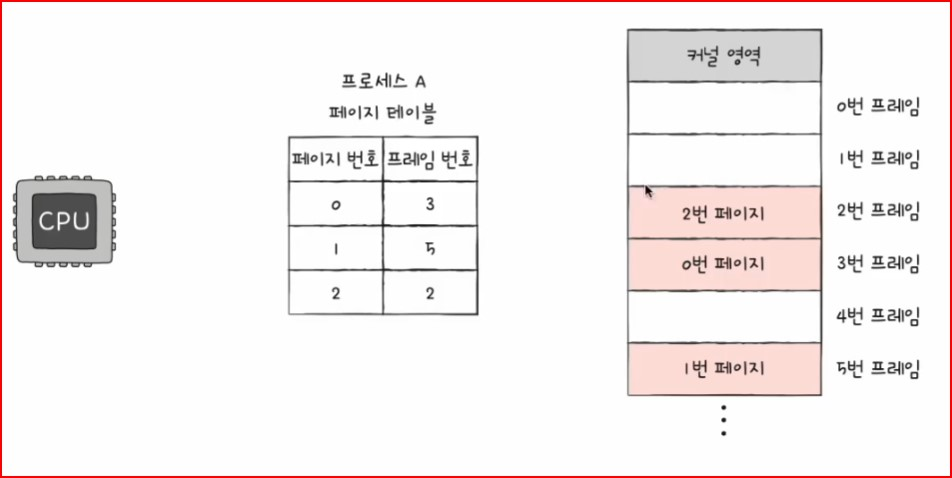

# Chap 14. 가상 메모리

## 01. 연속 메모리 할당

프로세스에 연속적인 메모리 공간을 할당하는 방식

### 스와핑

메모리에서 사용되지 않는 일부 프로세스들을 임시로 보조기억장치 일부 영역으로 쫓아내고, 그렇게 해서 생긴 메모리상의 빈 공간에 실행할 다른 프로세스를 적재하여 실행하는 방식

- `스왑 영역`: 프로세스들이 쫓겨나는 보조기억장치의 일부 영역
- `스왑 아웃`: 현재 실행되지 않는 프로세스가 메모리에서 스왑 영역으로 옮겨지는 것
- `스왑 인`: 스왑 영역에 있던 프로세스가 다시 메모리로 옮겨오는 것

### 메모리 할당

**[최초 적합]**  
운영체제가 메모리 내의 빈 공간을 순서대로 검색하다가 적재할 수 있는 공간을 발견하면 그 공간에 프로세스 배치  
발견 즉시 메모리 할당 → 검색 최소화, 빠른 할당 가능

**[최적 적합]**  
운영체제가 빈 공간을 모두 검색해 본 후, 프로세스가 적재될 수 있는 공간 중 가장 작은 공간에 프로세스 배치

**[최악 적합]**  
운영체제가 빈 공간을 모두 검색해 본 후, 프로세스가 적재될 수 있는 공간 중 가장 큰 공간에 프로세스를 배치하는 방식

### 외부 단편화

프로세스를 할당하기 어려울 만큼 작은 메모리 공간들로 인해 메모리가 낭비되는 현상  
ex. 사용자 영역에 50MB의 공간이 있지만 20MB, 30MB로 나누어져 있다면 그 크기보다 큰 프로세스들은 메모리 할당이 불가능

**해결 방안**

- `압축`: 메모리 조각을 하나로 모으는 방식  
   여기저기 흩어져 있는 빈 공간들을 하나로 모아서 큰 공간으로 만드는 방식
  - 단점
    공간을 모으는 동안 시스템은 하던 일 중지, 오버헤드 야기, 최적화된 명확한 방법 결정 어려움
- `페이징 기법`

## 02. 페이징을 통한 가상 메모리 관리

- `가상 메모리`: 실행하고자 하는 프로그램을 일부만 메모리에 적재하여 실제 물리 메모리 크기보다 더 큰 프로세스를 실행할 수 있게 하는 기술
  - 페이징(현재 대부분의 운영체제가 사용)
  - 세그멘테이션

### 페이징이란

외부 단편화 발생 이유?
→ 각기 다른 크기의 프로세스가 메모리에 연속적 할당

**페이징**  
프로세스의 논리 주소 공간은 `페이지`라는 일정한 단위로 자르고, 메모리 물리 주소 공간을 `프레임`이라는 페이지와 동일한 크기의 일정한 단위로 자른 뒤 페이지를 프레임에 할당하는 가상 메모리 관리 기법

- 페이징에서도 스와핑 사용 가능
- 페이징에서의 스왑 인은 페이지 인, 스왑 아웃은 페이징 아웃이라고 하기도 함

→ 한 프로세스를 실행하기 위해 프로세스 전체가 메모리에 적재될 필요는 없음

### 페이지 테이블

프로세스가 메모리에 불연속적으로 배치되어 있으면 CPU가 순차적으로 실행 불가능  
→ 이를 해결하기 위해 페이징 시스템은 물리 주소에 불연속적으로 배치되더라도 **논리 주소에는 연속적으로 배치되도록 페이지 테이블 사용**

> **내부 단편화**
>
> - 페이징은 외부 단편화 문제를 해결, but 내부 단편화 문제 야기
> - 하나의 페이지 크기보다 작은 크기로 발생  
>   ➡️ 내부 단편화를 적당히 방지하면서 너무 크지 않은 페이지 테이블이 만들어지도록 페이지 크기 조정하는 것이 중요 !!

- 페이지 테이블 베이스 레지스터: CPU내의 PTBR, 각 프로세스의 페이지 테이블이 적재된 주소를 가리킴

⚡️페이지 테이블을 메모리에 두면 메모리 접근 시간이 두 배로 늘어난다는 문제 발생  
→ 이를 해결하기 위해 CPU 곁에 `TLB`라는 페이지 테이블 캐시 메모리를 둠

**TLB**

- 페이지 테이블의 캐시
- 페이지 테이블의 일부 내용 저장
- 참조 지역성에 근거해 주로 최근에 사용된 페이지 위주로 가져와 저장
- `TLB 히트`: CPU가 발생한 논리 주소에 대한 페이지 번호가 TLB에 있는 경우
- `TLB 미스`: TLB에 페이지 번호가 없는 경우
