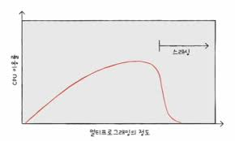

### 페이징에서의 주소 변환

하나의 페이지, 프레임은 여러 주소 포괄  
→ 특정 주소에 접근하려면 두가지 정보 필요

- 어떤 페이지 혹은 프레임에 접근하고 싶은지
- 접근하려는 주소가 그 페이지 혹은 프레임으로부터 얼마나 떨어져 있는지

페이징 시스템에서는 모든 논리 주소가 `페이지 번호` + `변위`

- 페이지 번호: 접근하고자 하는 페이지 번호
- 변위: 접근하려는 주소가 프레임의 시작 번지로부터 얼만큼 떨어져 있는지를 알기 위한 정보

➡️ 논리주소 <페이지 번호, 변위> 는 페이지 테이블을 통해 물리주소 <프레임 번호 변위> 로 변환

### 페이지 테이블 엔트리

페이지 테이블의 각각의 행

**[유효 비트]**  
현재 해당 페이지에 접근 가능한지 여부

- 프레임 번호 다음으로 중요한 정보
- 현재 페이지가 메모리에 적재되어 있는지, 보조기억장치에 있는지 알려주는 비트
- 페이지가 메모리에 적재 → 1, 메모리에 적재 되어 있지 않으면 0

**페이지 폴트**
CPU가 유효 비트가 0인 메모리에 적재되어 있지 않은 페이지로 접근하려고 하면 발생하는 예외

**[CPU가 페이지 폴트 처리하는 과정]**
① CPU는 기존 작업 내역 백업  
② 페이지 폴트 처리 루틴을 실행  
③ 페이지 처리 루틴은 원하는 페이지를 메모리로 가져온 뒤 유효 비트를 1로 변경  
④ 페이지 폴트를 처리했다면 이제 CPU는 해당 페이지에 접근 가능

**보호 비트**  
페이지 보호 기능을 위해 존재하는 비트

- 해당 페이지가 읽고 쓰기가 모두 가능한 페이지인지, 읽기만 가능한 페이지인지 나타낼 수 있음
- r, w, x

**참조 비트**  
CPU가 이 페이지에 접근한 적이 있는지 여부 나타냄

- 적재 이후 CPU가 읽거나 쓴 페이지는 참조 비트가 1, 한 번도 읽거나 쓰기가 없는 페이지는 0

**수정 비트**  
해당 페이지에 데이터를 쓴 적이 있는지 없는지 수정 여부 알려줌(=더티 비트)

- 변경된 적이 있으면 1, 없으면 0
- 페이지가 메모리에서 사라질 때 보조기억장치에 쓰기 작업을 해야하는지, 할 필요가 없는지 판단하기 위해 존재

> ### 쓰기 시 복사
>
> 부모 프로세스와 동일한 자식 프로세스가 생성되면 자식 프로세스로 하여금 부모 프로세스와 동일한 프레임 가리킴  
> → 굳이 부모 프로세스의 메모리 공간을 복사하지 않고도 동일한 코드 및 데이터 영역 가리킬 수 있음 !!
>
> 부모 or 자식 프로세스 중 하나라도 페이지에 쓰기 작업을 하면 그 순간 해당 페이지가 별도의 공간으로 복제 = `쓰기 시 복사`
>
> - 프로세스 생성 시간 줄임
> - 메모리 공간 절약 가능

## 03. 페이지 교체와 프레임 할당

### 요구 페이징

프로세스를 메모리에 적재할 때 처음부터 모든 페이지를 적재하지 않고 필요한 페이지만을 메모리에 적재하는 기법

[요구 페이징 기본 양상]  
① CPU가 특정 페이지에 접근하는 명령어 실행  
② 해당 페이지가 현재 메모리에 있는 경우(유효 비트가 1인 경우) CPU는 페이지가 적재된 프레임에 접근  
③ 해당 페이지가 현재 메모리에 없는 경우(유효 비트가 0인 경우) 페이지 폴트가 발생  
④ 페이지 폴트 처리 루틴은 해당 페이지를 메모리로 적재하고 유효 비트 1로 설정  
⑤ 다시 1번 수행

**순수 요구 페이징**  
아무런 페이지도 메모리에 적재되지 않은 채 무작정 실행되면 프로세스의 첫 명령어를 실행하는 순간부터 페이지 폴트 계속 발생  
실행에 필요한 페이지가 어느 정도 적재된 이후부터는 페이지 폴트 발생 빈도가 떨어지는 기법

[요구 페이징 시스템이 안정적으로 작동하기 위한 조건]  
① `페이지 교체`  
② `프레임 할당`

### 페이지 교체 알고리즘

일반적으로 페이지 폴트를 가장 적게 일으키는 알고리즘을 좋은 알고리즘으로 평가

**페이지 폴트 횟수**  
**페이지 참조열**을 통해 알 수 있음  
`페이지 참조열` = CPU가 참조하는 페이지들 중 연속된 페이지를 생략한 페이지열 의미

**[FIFO 페이지 교체 알고리즘]**  
메모리에 가장 먼저 올라온 페이지부터 내쫓는 방식

- 가장 단순한 방법
- 실행 초기에 적재된 페이지가 프로그램 실행 내내 사용될 내용을 포함한 경우 so bad.

> **2차 기회 페이지 교체 알고리즘**  
> fifo 페이지 교체 알고리즘의 부작용을 어느 정도 개선한 변형 알고리즘  
> 이름 그대로 기회를 한 번 더 주는 알고리즘
>
> - 페이지 참조 비트가 1인 경우, 당장 내쫓지 않고 참조 비트를 0으로 만든 뒤 현재 시간을 적재 시간으로 설정
> - 메모리에 가장 오래 머물렀다고 해도 참조 비트가 1이라는 의미는 CPU 접근이 있다는 의미로 기회 1번 더 줌

 

**[최적 페이지 교체 알고리즘]**  
CPU에 의해 참조되는 횟수를 고려하는 페이지 교체 알고리즘

- 보조기억장치로 내보내야 할 페이지는 사용 빈도가 가장 낮은 페이지
- 앞으로의 사용 빈도가 가장 낮은 페이지를 교체하는 알고리즘

⚡️ 가장 낮은 페이지 폴트율을 보장하는 알고리즘  
but, '앞으로 오랫동안 사용되지 않을 페이지'를 예측하기는 매우 어렵기 때문에 실제 구현도 어려움 !!  
→ 주로 다른 페이지 교체 알고리즘의 이론상 성능을 평가하기 위한 목적으로 사용

- 최적 페이지 교체 알고리즘을 실행했을 때 발생하는 페이지 폴트 횟수를 페이지 폴트의 하한선으로 간주,
- 최적 페이지 교체 알고리즘에 비해 얼만큼 페이지 폴트 횟수가 발생하는냐를 통해 페이지 교체 알고리즘을 평가

**[LRU 페이지 교체 알고리즘]**  
가장 오랫동안 사용되지 '않은' 페이지를 교체하는 알고리즘

- '최근에 사용되지 않은 페이지는 앞으로도 사용되지 않을 것'이라는 아이디어를 토대로 만들어짐
- 페이지마다 마지막으로 사용한 시간을 토대로 최근에 가장 사용이 적었던 페이지 교체

### 스래싱과 프레임 할당

프로세스가 사용할 수 있는 프레임 수가 적어도 페이지 폴트는 자주 발생  
→ 페이지 교체 알고리즘보다 더 근본적인 페이지 폴트 이유

**스래싱**  
프로세스가 실제 실행되는 시간보다 페이징에 더 많은 시간을 소요하여 성능이 저해되는 문제  
지나치게 빈번한 페이지 교체로 인해 CPU 이용률이 낮아지는 문제

멀티프로그래밍의 정도 = 메모리에서 동시 실행되는 프로세스의 수

 

스래싱 발생 원인  
= 각 프로세스가 필요로 하는 최소한의 프레임 수가 보장되지 않았기 때문

**프레임 할당 방식**  
정적 할당 방식

- 균등 할당: 모든 프로세스에 균등하게 프레임 제공
- 비례 할당: 프로세스의 크기가 크면 많이 할당, 작으면 적게 할당

동적 할당 방식

- 작업 집합 모델: 프로세스가 일정 기간 동안 참조한 페이지 집합을 기억하여 빈번한 페이지 교체를 방지
- 페이지 폴트 빈도: 페이지 폴트율에 상한선과 하한선을 정하고, 이 범위 안에서만 프레임 할당
  - 페이지 폴트율이 너무 높으몬 그 프로세스는 너무 적은 프레임을 갖고 있다
  - 페이지 폴트율이 너무 낮으면 그 프로세스는 너무 많은 프레임을 갖고 있다
