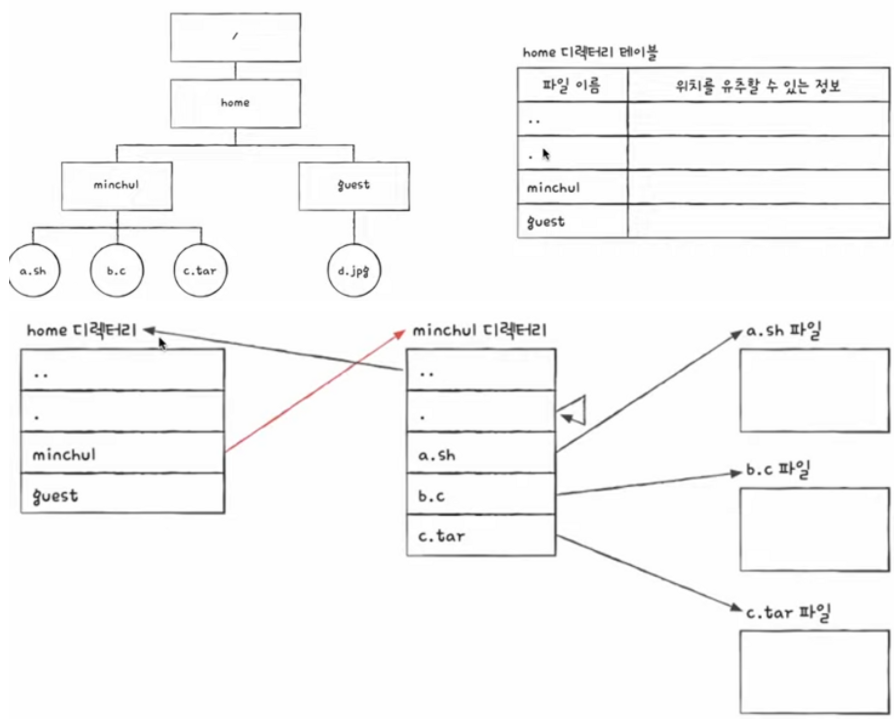
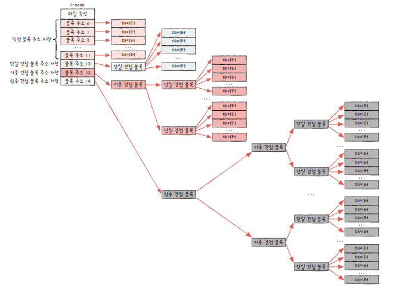

# Chap 15. 파일 시스템

## 01. 파일과 디렉터리

### 파일

하드 디스크나 SSD와 같은 보조기억장치에 저장된 관련 정보의 집합을 의미

- 속성: 파일 관련 부가 정보(=메타 데이터)

**[파일 속성과 유형]**

# 파업 관련 용어 정리

| 속성 이름        | 의미                                                                 |
| ---------------- | -------------------------------------------------------------------- |
| 유형             | 운영체제가 인지하는 파일의 종류를 나타냅니다.                        |
| 크기             | 파일의 현재 크기와 하향 가능한 최대 크기를 나타냅니다.               |
| 보호             | 어떤 사용자가 해당 파일을 읽고, 쓰고, 실행할 수 있는지를 나타냅니다. |
| 생성 날짜        | 파일이 생성된 날짜를 나타냅니다.                                     |
| 마지막 접근 날짜 | 파일에 마지막으로 접근한 날짜를 나타냅니다.                          |
| 마지막 수정 날짜 | 파일이 마지막으로 수정된 날짜를 나타냅니다.                          |
| 생성자           | 파일을 생성한 사용자를 나타냅니다.                                   |
| 소유자           | 파일을 소유한 사용자를 나타냅니다.                                   |
| 위치             | 파일의 보조기억장치상의 현재 위치를 나타냅니다.                      |

- 파일 유형은 `확장자`를 이용해 알림

**[파일 연산을 위한 시스템 호출]**  
파일은 무조건 운영체제의 `시스템 호출`에 의해 작업됨

### 디렉터리

윈도우에서는 '폴더'라고 불림

- 과거 1단계 디렉터리만 존재
- 이후 `트리 구조 디렉터리`로 발전
- 최상위 디렉터리는 `루트 디렉터리`라고 부름

`경로` = 디렉터리를 이용해 파일 위치, 파일 이름을 특정 짓는 정보

**[절대 경로와 상대 경로]**  
절대 경로 = 루트 디렉터리에서 자기 자신까지 이르는 고유한 경로  
상대 경로 = 현재 디렉터리부터 시작하느 ㄴ경로

**[디렉터리 연산을 위한 시스템 호출]**
생성, 삭제, 열기, 닫기 읽기

**[디렉터리 엔트리]**  

- 디렉터리 엔트리를 통해 보조기억장치에 저장된 위치를 알 수 있음
- 디렉터리에 속한 파일들의 이름과 이들의 위치를 알 수 있는 정보 등이 포함

## 02. 파일 시스템

파일과 디렉터리를 보조기억장치에 일목요연하게 저장하고 접근할 수 있게 하는 운영체제 내부 프로그램

### 파티셔닝과 포매팅

**파티셔닝**  
저장 장치의 논리적인 영역을 구획하는 작업 의미  
ex. 서랍 안에 칸막이 설치해서 영역 나누는 느낌쓰

- 파티션: 파티셔닝 작업을 통해 나누어진 각 영역

**포매팅**  
파일 시스템을 설정하여 어떤 방식으로 파일을 저장하고 관리할 것인지를 결정하고, 새로운 데이터를 쓸 준비를 하는 작업 의미

- 파티셔닝과 포매팅은 동시에 진행되는 경우가 많음
- 이미 포매팅까지 완료되어 판매되는 경우도 많음

### 파일 할당 방법

운영체제는 파일과 디렉터리를 `블록` 단위로 읽고 씀  
→ 하나의 파일이 보조기억장치에 저장될 대느 ㄴ하나 이상의 블록에 걸쳐 저장

**[연속 할당]**  
보조기억장치 내 연속적인 블록에 파일을 할당하는 방식

- 가장 단순한 방식
- 연속 할당된 파일에 접근하기 위해서는 파일의 첫 번째 블록 주소와 블록 단위의 길이만 알면 됨
- 파일이 삭제 or 수정되는 경우 `외부 단편화` 야기

**[연결 할당]**  
각 블록 일부에 다음 블록의 주소를 저장하여 각 블록이 다음 블록을 가리키는 형태로 할당

- 연속 할당의 문제 해결
- 파일을 이루는 데이터를 연결 리스트로 관리
- 디렉터리 엔트리에 파일 이름과 함께 첫 번째 블록 주소와 블록 단위의 길이 명시
- 디렉터리 엔트리만 봐도 어떤 파일이 어디에 저장되어 있는지 알 수 있음

⚡️ 연결 할당의 단점  
① 반드시 첫 번째 블록부터 하나씩 차례대로 읽어야 함

- 파일 내 임의의 위치에 접근하는 속도가 매우 느림(임의 접근 속도 느림)

② 하드웨어 고장이낭 오류 발생 시 해당 블록 이후 블록은 접근할 수 없음

- 하드웨어 고장이나 오류로 인해 파일을 이루는 블록에 하나라도 문제가 발생하면 그 블록 이후의 블록에 접근 불가

**[색인 할당]**  
파일의 모든 블록 주소를 `색인 블록`이라는 하나의 블록에 모아 관리하는 방식

- 파일 내 임의의 위치에 접근하기 쉬움
- 색인 블록 안에 파일을 구성하는 데이터 블록 주소가 있으므로 색인 블록만 알면 해당 파일 데이터에 접근 가능 !!
- 디렉터리 엔트리에 파일 이름과 더불이 `색인 블록 주소` 명시

### 파일 시스템 살펴보기

**[FAT 파일 시스템]**  
각 블록에 포함된 다음 블록의 주소들을 한데 모아 테이블 형태로 관리하면 앞서 연결 할당의 단점의 상당 부분 해소 가능  
= `파일 할당 테이블 FAT`

- 연결 할당의 단점을 보완한 파일 시스템

**[유닉스 파일 시스템]**

- 색인 할당 기반
- 색인 블록을 i-node라고 함
- i-node 하나는 기본적으로 15개의 블록 주소 저장  
  ① 블록 주소 중 열두 개에는 직접 블록 주소 저장  
  ② 1번 내용으로 충분하지 않다면 열세 번째 주소에 단일 간접 블록 주소 저장  
  ③ 2번 내용으로 충분하지 않다면 열네 번째 주소에 이중 간접 블록 주소 저장  
  ④ 3번 내용으로 충분하지 않다면 열다섯 번째 주소에 삼중 간접 블록 주소 저장

